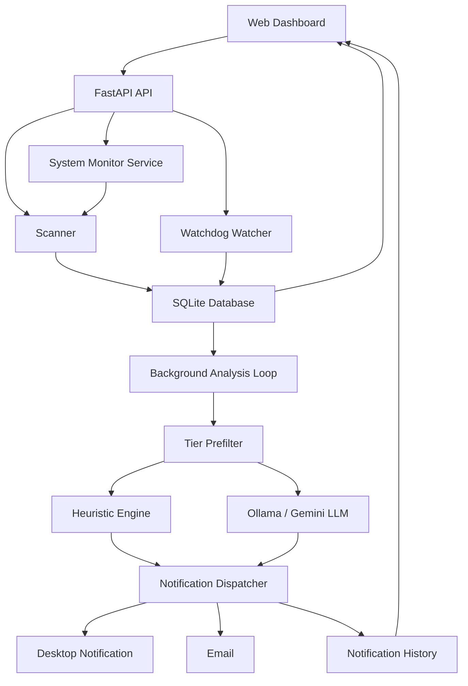

# IntegrityGuard Development and Design Documentation

## 1. Project Overview

IntegrityGuard is a local file integrity monitoring system built to detect, record, analyse, and prioritise filesystem changes. The project began as a traditional hash-based File Integrity Monitor (FIM), then evolved into a more operational tool that combines fast hashing, metadata-first reconciliation, file identity tracking, LLM/heuristic analysis, alert reduction, and a browser-based dashboard.

The system is designed for a single-host deployment. It uses Python, FastAPI, SQLite, SQLAlchemy, watchdog, and a static HTML/CSS/JavaScript frontend. Its main goals are:

- Establish a trusted baseline of monitored files.
- Detect new, modified, deleted, and renamed files.
- Preserve file timelines across renames and moves.
- Reduce alert fatigue through tiering, heuristics, LLM analysis, and batching.
- Keep large scans practical by avoiding unnecessary analysis and by using fast hash-first capture.
- Provide a user-friendly interface for scanning, monitoring, reviewing timelines, and receiving notifications.

## 2. Current System Capabilities

The current implementation supports:

- Manual directory scans through the dashboard or API.
- Hash-first baseline capture.
- Hybrid hashing with fast `xxh3_128` comparison hashes and optional `blake3` security hashes.
- Real-time filesystem watching via watchdog.
- System Monitor mode for recommended OS-specific paths.
- Metadata-first comparison scans that skip hashing unchanged files.
- Rename detection by platform file identity when available, with hash fallback.
- Stable file identity records so timelines survive path changes.
- Tree-backed directory records for scalable browsing.
- Background LLM/heuristic analysis.
- Analysis caching to avoid duplicate work.
- Backlog protection and low-value analysis demotion.
- Notification dispatching through desktop alerts, email configuration, batch digests, escalation, and in-app alert history.
- A dashboard with scan controls, progress metrics, severity filters, collapsible file tree navigation, timeline detail, and an alert center.

## 3. Development Timeline and Major Iterations

### 3.1 Initial FIM Prototype

The first version implemented the core FIM workflow:

- Walk a directory.
- Hash every file.
- Store path and hash in SQLite.
- Re-scan and compare hashes.
- Log new, modified, and deleted files.
- Display monitored files and timelines in the web UI.

This established the forensic core, but it treated too many events equally. Every baseline event could become an analysis task, which created large pending backlogs on real directories.

### 3.2 LLM and Heuristic Analysis

The project then added contextual analysis:

- `core/llm_analyzer.py` provides structured file-change analysis.
- Ollama is the primary LLM provider.
- Gemini can be used as a fallback when configured.
- A built-in heuristic engine acts as the final fallback and covers many suspicious patterns.
- Analysis returns fields such as risk score, priority, threat type, classification, confidence, findings, MITRE mapping, IOCs, reasoning, and recommended actions.

A key design decision was to preserve an offline-capable heuristic path. This means the tool still functions when no LLM is available.

### 3.3 Backlog Control and Baseline Rework

Large baseline scans exposed a severe scalability issue: treating baseline events as full analysis jobs could create tens of thousands of pending records. The baseline path was redesigned:

- Baseline capture prioritises recording integrity state first.
- Normal baseline files become recorded events instead of pending analysis jobs.
- Only suspicious or high-value baseline files are queued for deeper content analysis.
- Baseline analysis can be capped through configuration.
- Pending-analysis count is surfaced in API and UI statistics.

This decision separated integrity capture from content analysis. It made the baseline phase much more predictable.

### 3.4 Notification Pipeline

The notification system evolved from simple alerts into a staged dispatch model:

- Critical and high events can trigger immediate desktop/email alerts.
- Medium events can be batched into digest notifications.
- Low and info events are silently logged.
- Multiple medium events within a window can escalate into an immediate alert.
- Notification history is stored in an in-memory ring buffer and exposed through `/api/notifications/history`.
- The dashboard now includes an Alert Center with unread count and desktop notification controls.

The guiding principle is that users should be interrupted only by actionable events.

### 3.5 Tree-Backed Storage and Stable File Identity

The UI initially treated paths as the main identity. This caused renamed files to appear as different files. The storage model was extended:

- `DirectoryNode` stores directory hierarchy.
- `FileIdentity` stores stable logical identity across renames/moves.
- `FileRecord` stores current known state.
- `FileLog` stores chronological event history.
- Timelines can be queried by `file_id` as well as path.
- Rename detection uses OS-reported platform file IDs where possible.
- Hash fallback is used when platform identity is unavailable.

This decision makes the system more suitable for long-running monitoring, where files are frequently renamed or reorganised.

### 3.6 Scan Sessions and Progress Metrics

Scan visibility was improved through persisted scan sessions:

- `ScanSession` records scan trigger, mode, status, totals, counters, errors, and result JSON.
- `/api/scan/status` reports active progress.
- `/api/scans` and `/api/scans/latest` expose history.
- The frontend shows files/sec, hash rate, hashed bytes, elapsed time, hash time, DB commit time, errors, and worker count.

This was added because long scans need transparent progress and measurable performance.

### 3.7 WizTree-Inspired Performance Direction

The project explored why tools like WizTree are extremely fast. The main conclusion was:

- WizTree-style tools are fast because they read filesystem metadata structures, not every byte of file content.
- Cryptographic hashing is fundamentally slower because every byte must be read at least once.
- NTFS/exFAT do not provide ready-made per-file SHA/BLAKE hashes.

The system therefore moved toward a metadata-first model:

- Initial state capture should be as fast as possible.
- Future scans should avoid hashing unchanged files.
- Platform file IDs and size/mtime checks should prevent unnecessary content reads.
- Full content hashing should be targeted rather than repeated blindly.

An NTFS MFT/USN Journal adapter remains a future optimization path.

### 3.8 Hashing Optimization

Hashing went through multiple iterations:

1. `sha256` default.
2. `blake3` default for faster cryptographic hashing.
3. Larger read chunks.
4. BLAKE3 thread tuning.
5. Parallel baseline hashing workers.
6. Hybrid `xxh3_128` plus `blake3`.

The current default is hybrid:

- `xxh3_128` is used as the fast comparison hash.
- `blake3` is used as the security-grade hash for deeper verification.
- Baseline hashing runs with configurable workers.
- DB writes remain single-threaded because DB time is not the bottleneck.

Observed development benchmarks showed that:

- SQLite commit time was typically under a few seconds for large scans.
- The main bottleneck was disk read throughput.
- Worker tuning improved throughput substantially, but too many workers could reduce throughput.
- A target of sustained 1 GB/s depends heavily on storage hardware, file sizes, cache state, and Windows I/O behavior.

## 4. Current Architecture



## 5. Core Backend Components

### 5.1 `core/api.py`

FastAPI application and integration layer. It:

- Serves the static frontend.
- Starts background analysis and notification threads.
- Exposes scan, watch, system monitor, stats, tree, baseline, timeline, notification, and platform endpoints.
- Maintains current in-memory scan status for the UI.
- Persists scan sessions.

Important endpoints include:

- `POST /api/scan`
- `POST /api/initialize-watch`
- `POST /api/watch/start`
- `POST /api/watch/stop`
- `GET /api/scan/status`
- `GET /api/scans`
- `GET /api/scans/latest`
- `GET /api/stats`
- `GET /api/baseline`
- `GET /api/files/timeline`
- `GET /api/tree`
- `POST /api/system-monitor/toggle`
- `GET /api/notifications/history`
- `GET /api/notifications/config`

### 5.2 `core/scanner.py`

Handles directory scans and reconciliation. Current design:

- Walks directories while skipping noisy/excluded paths.
- Captures baseline records in hash-first mode.
- Uses a bounded worker pool for hashing.
- Records fast comparison hashes first.
- Defers expensive content/security analysis where possible.
- Performs metadata-first compare scans.
- Detects renames through platform file IDs and same-hash fallback.

The scanner is deliberately responsible for integrity state, not notification decisions.

### 5.3 `core/hasher.py`

Hashing utility. It supports:

- `xxh3_128` through `xxhash`.
- `blake3` through the BLAKE3 Python package.
- Standard `hashlib` algorithms.
- Configurable chunk size.
- Configurable BLAKE3 thread count.

Current default comparison hash is `xxh3_128`. Current security hash is `blake3`.

### 5.4 `core/watcher.py`

Real-time filesystem monitor using watchdog. It handles:

- Created files.
- Modified files.
- Deleted files.
- Moved/renamed files.
- Debouncing duplicate rapid events.
- Stable identity attachment.

The watcher hashes changed files and inserts `FileLog` rows for analysis.

### 5.5 `core/background_analysis.py`

Background worker that drains pending `FileLog` rows. It implements:

- Backlog detection and heuristic-only mode under load.
- Event coalescing.
- Tier prefiltering.
- Content snippet loading for deferred baseline events.
- Change context construction.
- Analysis cache usage.
- LLM/heuristic analysis.
- Notification dispatch enqueueing.
- Hybrid security-hash enrichment for analyzed files.

### 5.6 `core/notification_dispatcher.py`

Dispatches events based on priority and risk:

- Immediate alerts for critical/high events.
- Batch digest for medium events.
- Silent log for low/info events.
- Escalation when medium events accumulate quickly.
- Optional desktop notifications.
- Optional SMTP email.
- In-memory notification history for UI retrieval.

### 5.7 `core/models.py`

Main database models:

- `FileIdentity`: stable identity for a file across path changes.
- `FileRecord`: current monitored file state.
- `DirectoryNode`: tree representation of directories.
- `ScanSession`: persisted scan summary and counters.
- `AnalysisCache`: reusable analysis verdict cache.
- `FileLog`: chronological event log.

### 5.8 `core/database.py`

SQLite/SQLAlchemy setup and lightweight additive migrations. Indexes were added for common queries:

- path lookup
- hash lookup
- file identity lookup
- directory tree browsing
- pending queue filtering
- notification/timeline retrieval
- analysis cache lookup

### 5.9 `core/platform_paths.py`

Defines cross-platform path criticality tiers and noisy directory rules.

Tiers guide alerting behavior:

- Tier 1: critical system/security paths.
- Tier 2: high-value configuration/security paths.
- Tier 3: general application/user data.
- Tier 4: low-value temp/cache/log churn.

## 6. Frontend Design

The frontend is a static dashboard in `web/index.html`, `web/style.css`, and `web/app.js`.

The UI evolved through multiple design experiments. The final direction is a professional operational dashboard rather than an illustrative or stylized landing page. Current UI priorities:

- Dense but readable information.
- Full viewport usage.
- Pure operational controls instead of decorative navigation.
- Clear progress and status.
- Collapsible tree navigation for large scans.
- Timeline-first forensic review.
- Explicit notification controls.

Key features:

- Scan and watch controls.
- System Monitor toggle.
- Reanalysis option.
- Queue meter.
- Hash mode badge.
- Progress metrics.
- Severity summary cards.
- Priority filters.
- Collapsible file tree.
- Search with matching branch expansion.
- Timeline with event analysis cards.
- Toast notifications.
- Desktop notification opt-in.
- Persistent Alert Center.

## 7. Data Model Design

### 7.1 File Identity vs File Path

Earlier versions keyed too much behavior on `path`. This broke continuity when files were renamed. The current model separates:

- logical identity: `FileIdentity`
- current state: `FileRecord`
- history: `FileLog`

This lets one file maintain a continuous timeline even when its path changes.

### 7.2 Directory Tree Model

Large scans need hierarchical browsing. `DirectoryNode` stores:

- parent ID
- directory name
- full path
- depth
- last seen timestamp

`FileRecord.directory_id` links files to the directory tree. The API also exposes `/api/tree` for lazy browsing, although the current frontend still primarily builds a client-side tree from baseline rows.

### 7.3 Hash Fields

The hybrid model distinguishes:

- `hash`: active comparison hash used by existing logic.
- `hash_algorithm`: algorithm used for `hash`.
- `fast_hash`: explicit fast digest, currently `xxh3_128`.
- `security_hash`: optional BLAKE3 digest.
- `security_hash_algorithm`: algorithm used for the security hash.

This avoids pretending that a fast non-cryptographic hash is equivalent to a security-grade digest.

## 8. Hashing and Performance Decisions

### 8.1 Why Hashes Are Created by the Tool

NTFS and exFAT do not store ready-made cryptographic content hashes for every file. They store metadata such as file size, timestamps, attributes, directory entries, and file IDs. Therefore, a content hash requires reading file bytes.

### 8.2 Why Hybrid Hashing Was Chosen

BLAKE3 is much faster than SHA-256 and is cryptographic, but large scans still require reading every byte. xxHash/XXH3 is faster but not cryptographic.

The chosen hybrid approach gives both:

- Fast initial comparison using `xxh3_128`.
- Stronger verification using BLAKE3 when needed.

This makes the UI feel faster while preserving an upgrade path for security-grade verification.

### 8.3 Worker Tuning

Parallel hashing was introduced because a single file-read loop underutilized some storage setups. The scanner now uses configurable baseline workers.

Important observation:

- More workers are not always faster.
- Worker counts improve queue depth up to a point.
- Too many workers can increase random I/O and reduce throughput.
- The best setting depends on SSD/HDD/NVMe/external drive behavior.

Current default:

- `FIM_BASELINE_HASH_WORKERS`: up to `16`
- `FIM_HASH_CHUNK_SIZE`: `4 MiB`
- `FIM_BLAKE3_MAX_THREADS`: `1`

## 9. Analysis Pipeline Decisions

The analysis pipeline is staged:

1. Capture the file event.
2. Apply tier-based prefiltering.
3. Build content/change context where useful.
4. Use analysis cache when possible.
5. Run heuristic or LLM analysis.
6. Store structured verdict.
7. Dispatch notifications based on severity.

Important design decisions:

- Tier 4 paths are usually low value, but readable content can override path-only classification.
- Suspicious baseline files can still be queued for analysis.
- Backlog mode uses heuristic-only processing to drain queues safely.
- Duplicate content/change contexts can reuse cached analysis.
- LLM output is not the only source of truth; local heuristics remain available.

## 10. Notification Design

The notification system was designed to reduce alert fatigue:

- Critical/high: interrupt the user.
- Medium: batch unless pattern escalation occurs.
- Low/info: log silently.

The frontend now gives users:

- Toast notification toggle.
- Desktop notification toggle.
- Browser permission request flow.
- Alert Center with unread count.
- Recent notification history.
- Click-through from notification history to file timeline.

This creates a more industry-standard workflow: alert, triage, review, retain audit trail.

## 11. System Monitor Design

System Monitor mode collects recommended filesystem and registry paths for the current OS. When enabled:

- It starts watchers for supported filesystem paths.
- It starts registry monitoring where supported.
- It triggers visible directory scans so the dashboard has an indexed baseline.

This was added because a monitor that silently watches paths without showing them in the UI is difficult for users to trust.

## 12. UI Design Decisions

Several UI directions were explored, including stylized dark dashboards and cinematic grid layouts. The final direction moved toward an industry-standard operational UI.

Final UI principles:

- Avoid decorative complexity.
- Use full viewport space.
- Keep controls clear and close to workflows.
- Show progress and throughput directly.
- Make pending work visible.
- Support large directory navigation.
- Keep notification settings explicit.

The file sidebar was redesigned because large directory scans made flat lists hard to use. The current tree:

- Groups files by root.
- Shows collapsible directories.
- Displays counts.
- Inherits severity state.
- Expands search matches and the selected file path.

## 13. Configuration Summary

Important environment variables:

| Variable | Default | Purpose |
|---|---:|---|
| `FIM_HASH_MODE` | `hybrid` | Hash strategy |
| `FIM_HASH_ALGORITHM` | `xxh3_128` | Fast comparison hash |
| `FIM_SECURITY_HASH_ALGORITHM` | `blake3` | Security hash |
| `FIM_HASH_CHUNK_SIZE` | `4194304` | File read chunk size |
| `FIM_BLAKE3_MAX_THREADS` | `1` | BLAKE3 threads per file |
| `FIM_BASELINE_HASH_WORKERS` | up to `16` | Parallel baseline hash workers |
| `FIM_BASELINE_CAPTURE_MODE` | `hash_first` | Baseline strategy |
| `FIM_BASELINE_COMMIT_BATCH_SIZE` | `1000` | DB commit batch size |
| `FIM_BASELINE_DEFERRED_ANALYSIS_LIMIT` | `5000` | Max deferred baseline analysis jobs |
| `FIM_ANALYSIS_BACKLOG_THRESHOLD` | `500` | Backlog threshold |
| `FIM_ANALYSIS_PENDING_HARD_CAP` | `5000` | Pending queue hard cap |
| `OLLAMA_URL` | `http://localhost:11434/api/generate` | Ollama endpoint |
| `OLLAMA_MODEL` | `gemma4:latest` | Ollama model |
| `GEMINI_API_KEY` | empty | Enables Gemini fallback |

## 14. Testing Strategy

The test suite covers:

- Hashing behavior.
- Metadata extraction.
- Database models.
- Baseline scan behavior.
- API scan/session counters.
- Timeline visibility.
- Metadata-first compare scans.
- Rename handling.
- Tree population.
- Background analysis behavior.
- Analysis cache reuse.
- Notification dispatcher behavior.
- Provider fallback behavior.
- Tier 4 content override behavior.
- Platform path tiering.

Common validation commands:

```powershell
python -m py_compile core\config.py core\hasher.py core\models.py core\database.py core\scanner.py core\background_analysis.py core\api.py
node --check web\app.js
python -m pytest tests -q
```

## 15. Known Limitations

Current known limitations:

- Full initial content hashing is still constrained by disk throughput.
- `xxh3_128` is not cryptographic and should not be treated as a security proof.
- BLAKE3 security hash coverage is currently deferred and not yet represented as a full coverage dashboard.
- Notification history is in-memory and resets when the process restarts.
- The frontend tree still uses `/api/baseline` rows rather than fully lazy `/api/tree` browsing.
- NTFS MFT/USN Journal scanning is not implemented.
- Pause/cancel scan controls are not implemented in the UI.
- Existing rows are upgraded by additive migrations, but a full migration/rebuild path would be cleaner for production.

## 16. Remaining Roadmap

High-value next steps:

1. Add a true background security-hash coverage queue.
2. Add a UI indicator for BLAKE3 coverage percentage.
3. Persist notification acknowledgements/resolution state in SQLite.
4. Add alert states such as `needs_review`, `resolved`, `muted`, and `ignored`.
5. Move the frontend file browser to the lazy `/api/tree` endpoint for very large baselines.
6. Add scan cancellation and pause/resume.
7. Add NTFS MFT/USN Journal enumeration for Windows fast-path scanning.
8. Add benchmark reporting per scan session.
9. Add a hardware/storage capability panel so users understand when disk throughput is the bottleneck.
10. Expand dissertation evaluation: false positives, false negatives, alert reduction ratio, and scan throughput across datasets.

## 17. Development Decision Summary

The most important decisions so far:

- Keep the system local and lightweight rather than adding a workflow orchestrator.
- Use SQLite because the target deployment is single-host.
- Separate integrity capture from content analysis.
- Prefer metadata-first comparison after baseline.
- Preserve file identity independently from path.
- Use a tree-backed model for large directory browsing.
- Use hybrid hashing for speed plus security.
- Keep heuristics as a reliable fallback to LLMs.
- Treat notifications as a staged workflow, not raw event spam.
- Make the UI operational and professional rather than decorative.

## 18. Current State

As of this document, the system is a functional local FIM prototype with:

- hybrid hash-first scanning,
- stable file timelines,
- tree-backed browsing,
- contextual analysis,
- notification dispatch,
- in-app alert center,
- scan metrics,
- backlog protection,
- and a professional dashboard.

The next architectural leap is to stop treating the initial scan as "hash everything before it feels complete." The future direction should be:

1. capture metadata/file IDs almost immediately,
2. show files as indexed,
3. compute fast hashes,
4. compute BLAKE3 security coverage in the background,
5. analyze only content that matters.

That is the path closest to a WizTree-like experience while preserving the security goals of a file integrity monitor.
