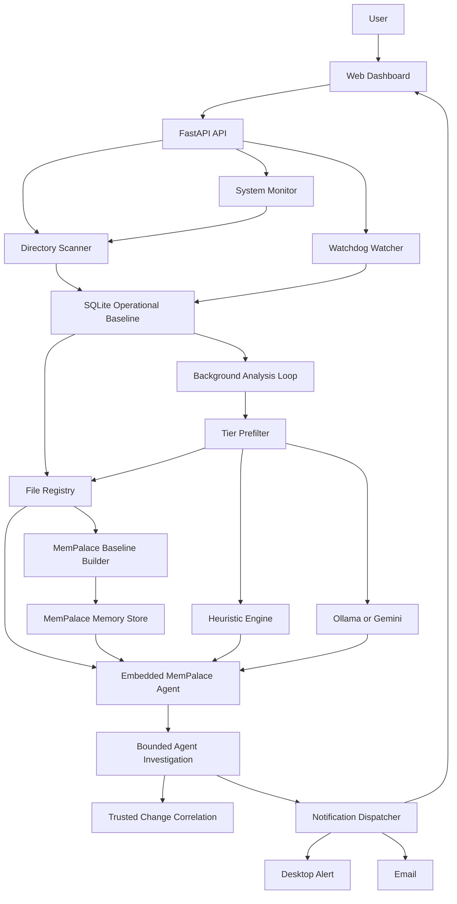

# IntegrityGuard Dissertation Development Log

## Purpose

This document records the design and development history of IntegrityGuard for dissertation use. It is written as an engineering log rather than a user manual. It explains what was built, why each major design decision was taken, what tradeoffs were accepted, and how the current system differs from a basic hash-only file integrity monitor.

Read this together with:

- `docs/DEVELOPMENT_AND_DESIGN.md` for the compact architecture reference.
- `OPTIMIZATION_PLAN.md` for the feedback-driven optimization checklist.
- `tasks.md` for phase-level implementation tracking.
- `tests/` for executable evidence of behavior.

## Project Thesis

IntegrityGuard began as a traditional file integrity monitor. Its initial purpose was to establish a trusted file baseline, detect future changes, and report whether files had been created, modified, deleted, or renamed. During development, the project evolved into a hybrid integrity and contextual analysis system.

The current research contribution is not simply hashing files. The contribution is the combination of:

- fast local baseline capture,
- stable file identity across renames,
- tier-aware file importance classification,
- content-aware LLM/heuristic analysis,
- MemPalace-backed file intelligence memory,
- bounded agent investigation for important events,
- and notification handling designed to reduce alert fatigue.

The final system is intentionally local and lightweight. It does not require a distributed message broker, external workflow orchestrator, or cloud service to run. Optional LLM and MemPalace components enhance analysis, but deterministic heuristics and SQL state remain available as the operational baseline.

## Current System Summary

IntegrityGuard is a Python/FastAPI application with a SQLite database, SQLAlchemy models, watchdog-based filesystem monitoring, optional Ollama/Gemini analysis, a real MemPalace memory backend, and a static browser dashboard.

At the current stage, the system can:

- scan a directory and establish an integrity baseline,
- hash files with a fast hybrid strategy,
- track file metadata, hash values, path, directory tree position, and stable identity,
- detect modified, new, deleted, and renamed files,
- preserve a single timeline across rename events,
- classify files into semantic tiers,
- use heuristic or LLM analysis for content-aware risk scoring,
- build a persistent registry of file roles and expected change sources,
- seed MemPalace with baseline identity memories,
- retrieve related MemPalace memories during later analysis,
- run an embedded MemPalace agent for contextual reasoning,
- run bounded investigation checks for critical/high events,
- correlate changes with trusted operational sources,
- dispatch desktop/email/in-app notifications,
- expose scan progress and backlog status in the dashboard,
- and provide a professional UI for scanning, monitoring, alert triage, and timeline review.

## High-Level Architecture



The architecture is deliberately staged. The scanner and watcher capture evidence. The SQL database remains the source of truth. The registry adds semantic identity. MemPalace acts as derived long-term context. The agent reasons over important changes. The notification layer decides what deserves interruption.

## Development Chronology

### Stage 1: Basic Hash-Based File Integrity Monitor

The first implementation focused on the minimum viable FIM workflow:

- walk a user-selected directory,
- hash every file,
- store file path and hash in SQLite,
- compare later scans against the baseline,
- create file events for new, modified, and deleted files,
- display monitored files and timelines in the browser UI.

This proved the core integrity concept, but it also exposed an early limitation: path and hash alone are not enough to explain file importance. A modification to a temporary log and a modification to an authentication file initially looked similar unless additional context was added.

### Stage 2: LLM and Heuristic Analysis

The system then added content-aware analysis in `core/llm_analyzer.py`. The analysis layer was designed to return structured verdicts, including:

- `risk_score`,
- `priority`,
- `is_malicious`,
- `threat_type`,
- `threat_classification`,
- `confidence`,
- `findings`,
- `mitre_attack`,
- `iocs`,
- `reasoning`,
- and `recommended_actions`.

Ollama was selected as the primary local LLM provider to keep the project privacy-preserving and runnable on a single host. Gemini was added as an optional fallback. A deterministic heuristic engine was kept as the final fallback so the project can still operate without an LLM.

This design is important for dissertation framing: the system does not blindly trust an LLM. It uses LLMs as one analysis source inside a larger deterministic pipeline.

### Stage 3: Backlog Problem and Baseline Redesign

Large scans showed that treating every baseline event as a pending analysis job was not scalable. During testing, a scan could produce tens of thousands of pending analysis rows. Logs showed backlog warnings with large pending queues being drained in heuristic-only mode.

The baseline process was redesigned around a key separation:

- integrity capture should happen first and quickly,
- content analysis should be selective and delayed when necessary.

The revised baseline behavior records normal baseline files as baseline state instead of forcing every file through full LLM analysis. Suspicious or high-value baseline files can still be queued for analysis, but low-value baseline files are recorded cheaply. This made the system more practical for directories with large file counts.

### Stage 4: Notification Pipeline

Early notification behavior was too raw. The system needed to distinguish audit logging from user interruption. The notification dispatcher was therefore redesigned around severity:

- critical/high events can interrupt immediately,
- medium events can be batched,
- low/info events are logged silently,
- repeated medium events can escalate,
- notification history is exposed to the UI,
- desktop notifications are opt-in,
- email settings are supported,
- and agent-authored summaries are included when available.

This moved the system closer to an industry-standard alert workflow: alert, triage, inspect evidence, and retain an audit trail.

### Stage 5: UI Iteration and Final Dashboard Direction

Several UI directions were explored. The project experimented with stylized dark dashboards, awwwards-inspired Swiss design, and cinematic grid-style interfaces. These designs were visually expressive but not ideal for a monitoring tool.

The final design direction moved toward a professional operational dashboard:

- full viewport usage,
- compact header,
- clear scan/watch/system monitor controls,
- visible queue and hash-mode state,
- severity summary cards,
- collapsible file tree,
- searchable monitored file list,
- event timeline,
- analysis cards with concrete evidence,
- alert center,
- explicit notification toggles,
- and responsive scrolling for large datasets.

The reason for this decision was usability. A FIM dashboard must support repeated operational review rather than look like a marketing page or concept UI.

### Stage 6: Tree-Backed Storage and Stable File Identity

Rename behavior exposed an important data-model issue. When a file was renamed, the first implementation could treat it as a deleted file plus a new file. This fragmented the timeline.

The model was extended with:

- `FileIdentity` for stable logical identity,
- `DirectoryNode` for scalable directory hierarchy,
- `FileRecord` for current state,
- `FileLog` for event history,
- and `file_id` references so timelines can survive path changes.

Rename detection now uses platform file identity where available. If the operating system does not provide enough identity information, the scanner can fall back to hash-based matching.

This is a major dissertation-relevant design point because it changes the system from path tracking to entity tracking. In a long-running monitor, the file is the monitored object, not merely the current string path.

### Stage 7: Scan Sessions and Performance Visibility

Long scans need progress visibility. `ScanSession` was added to persist scan status and metrics:

- root path,
- trigger,
- mode,
- status,
- discovered file count,
- baseline new/updated counts,
- reanalysis counts,
- changed/new/deleted/renamed counts,
- hashed count,
- metadata-skipped count,
- platform rename count,
- errors,
- timing and result JSON.

The UI was updated to show:

- files per second,
- hash rate,
- bytes hashed,
- elapsed time,
- hash time,
- DB commit count/time,
- worker count,
- and current scan mode.

This supports both user trust and later evaluation. The tool can now report how a scan performed instead of simply appearing busy.

### Stage 8: WizTree-Inspired Scanning Investigation

The project investigated why tools like WizTree scan so quickly. The conclusion was that WizTree-style tools are fast because they read filesystem metadata structures rather than hashing every byte of every file.

A key finding was:

- NTFS and exFAT do not store ready-made per-file cryptographic hashes.
- Any true content hash requires reading the file bytes.
- Therefore, hashing all files will always be limited by disk throughput.

The system moved toward a metadata-first strategy:

- use path, size, modified time, and platform file ID to avoid unnecessary hashing,
- hash only when metadata indicates change,
- capture baseline state first,
- defer deeper security verification where possible,
- and leave NTFS MFT/USN Journal enumeration as a future optimization.

### Stage 9: Hashing Algorithm Optimization

Hashing performance was tuned over several iterations:

1. SHA-256 was the original conservative choice.
2. BLAKE3 was introduced as a faster cryptographic hash.
3. Larger read chunks were added.
4. BLAKE3 thread behavior was made configurable.
5. Parallel baseline hash workers were added.
6. A hybrid hash mode was implemented using `xxh3_128` for fast comparison and BLAKE3 for security verification.

Development observations showed that the disk read path, not SQLite commits, was usually the bottleneck. Example observed scan metrics during tuning included:

| Observation | Files/s | Hash rate | Hashed data | Elapsed |
|---|---:|---:|---:|---:|
| Early slow run | 14.0 | 436.1 MB/s | 12.2 GB | 28.7 s |
| Larger run | 35.8 | 387.1 MB/s | 97.1 GB | 4m 17s |
| Worker-tuned run | 74.1 | 704.6 MB/s | 33.4 GB | 48.6 s |
| Hybrid run | 68.1 | 813.7 MB/s | 71.2 GB | 1m 30s |

These numbers were development observations rather than controlled scientific benchmarks. They are still useful because they shaped the design: increasing workers helps only up to the limits of storage behavior, file size distribution, OS cache state, and random I/O overhead.

### Stage 10: System Monitor Mode

System Monitor mode was introduced to monitor OS-relevant paths rather than only arbitrary user-selected directories. The initial design silently watched paths, but that was not transparent enough for users. It was changed so enabling System Monitor also starts visible directory scans for supported paths, allowing users to see indexed files in the dashboard.

The monitor is cross-platform in intent:

- Linux paths include sensitive system and authentication paths.
- Windows support includes filesystem paths and registry-oriented monitoring where supported.
- macOS support uses platform-specific paths where applicable.

This matters because the project should not be Linux-only. The file registry and agent prompts explicitly reason about Windows, Linux, macOS, and unknown path formats.

### Stage 11: File Registry and Identity-Based Risk

The system then added a persistent file intelligence registry in `core/services/file_registry.py`. The registry classifies what a file is, not just what its content contains.

Each registry entry can store:

- path,
- normalized path,
- file name,
- tier,
- tier label,
- semantic role,
- asset type,
- file category,
- confidence,
- expected change sources,
- last known good hash,
- fast hash,
- security hash,
- size,
- modified time,
- path history,
- active state,
- first seen time,
- last seen time,
- and updated time.

This addressed a key weakness of content-only analysis. For example, replacing a critical binary or privilege file with empty content may not contain suspicious strings, but the identity of the file is still high risk. The registry lets the system raise severity based on file role.

### Stage 12: Real MemPalace Integration

The initial agent concept used the word "MemPalace" as an architecture idea. It was later changed to use the actual `mempalace` package through `core/services/mempalace_bridge.py`.

The bridge performs:

- backend availability checks,
- event memory writes,
- baseline identity memory writes,
- related memory retrieval,
- fallback lexical search when supported,
- JSON-safe normalization of search results,
- and memory metadata annotation.

MemPalace is used as a derived context layer. SQL remains the operational source of truth. MemPalace stores contextual memories that help the agent reason about file identity, historical events, related roles, previous verdicts, and suspicious content indicators.

### Stage 13: Baseline Memory Builder

`core/services/mempalace_baseline_builder.py` was added so the agent memory is seeded from the SQL baseline. This implements the expected flow:

1. The scanner builds the SQL baseline.
2. The registry classifies file identities.
3. The baseline builder writes selected high-value registry entries into MemPalace.
4. Future change events can retrieve those memories.

The builder deliberately does not store every low-value cache/log/temp file by default. Tier 4 storage can be enabled, but the default behavior focuses memory capacity on high-value identities.

### Stage 14: Embedded MemPalace Agent Core

`core/services/mempalace_agent.py` implements the embedded file-intelligence agent. It is not a separate daemon or external agent service. It runs in the same process as the background analysis pipeline.

The agent receives:

- event path,
- event type,
- registry context,
- content payload,
- previous snippet availability,
- change summary,
- MemPalace memory status,
- related memories,
- and the system analysis verdict.

It can produce:

- an identity interpretation,
- a content assessment,
- findings,
- risk score,
- priority,
- confidence,
- explanation,
- and recommended actions.

The agent is local-first. It includes deterministic content inspection and can optionally call PydanticAI/Ollama for typed LLM output depending on configuration.

### Stage 15: Agent Investigation Layer

`core/services/agent_investigator.py` was added to make important events visibly investigated rather than only reworded. This layer runs bounded tool-style checks for critical/high or policy-selected events:

- current file state inspection,
- trusted-change correlation,
- MemPalace related-memory evidence,
- agent content inspection,
- and Windows Authenticode signature checks for relevant executable file types.

The result is stored in `analysis_json["agent_investigation"]` and summarized in `analysis_json["agent_notification"]`. The UI can show each observation, status, confidence, and recommended action.

This is the point where the agent becomes more than a label. It has its own investigation report, tools used, skip reasons, confidence, and notification narrative.

### Stage 16: Trusted Change Correlation

`core/services/trusted_change.py` was added so critical-path changes are not automatically treated as malicious when there is evidence of legitimate maintenance.

Supported evidence includes:

- package-manager metadata,
- installer metadata,
- Windows Update metadata,
- deployment IDs,
- approved change IDs,
- maintenance windows attached to event metadata,
- configured maintenance windows,
- and lightweight OS update context.

The design is intentionally conservative. A trusted source can explain a change, but the system does not silently downgrade important events without evidence.

### Stage 17: Richer MemPalace Retrieval

MemPalace retrieval was expanded beyond exact path matching. Current retrieval strategies include:

- exact path,
- path history,
- role and tier,
- previous verdict,
- and content indicators.

This helps the agent retrieve useful context even when a file has moved, been renamed, or shares a semantic role with previous suspicious files.

### Stage 18: Investigation Drawer in the UI

The dashboard timeline was extended to display agent investigation evidence without requiring raw JSON inspection. For high-value events, the UI can show:

- investigation summary,
- trusted-change status,
- tool observations,
- MemPalace retrieval proof,
- confidence,
- and recommended next actions.

This matters for dissertation evaluation because alert explainability is one of the system's intended improvements over a raw hash-difference monitor.

### Stage 19: Agent Performance Isolation

Deep investigation must not block baseline scanning or backlog recovery. The agent investigation stage was therefore made queue-aware and budgeted.

New controls include:

- `FIM_AGENT_INVESTIGATION_MAX_PER_BATCH`,
- `FIM_AGENT_INVESTIGATION_BACKLOG_THRESHOLD`,
- `FIM_AGENT_INVESTIGATION_BACKLOG_CRITICAL_ONLY`,
- and `FIM_AGENT_INVESTIGATION_SIGNATURE_TIMEOUT_SECONDS`.

During backlog pressure, non-critical investigations can be skipped with structured reasons such as:

- `performance_backlog_guard`,
- `performance_batch_budget_exhausted`.

Critical drivers still pass through, including:

- critical priority,
- risk score 9 or higher,
- Tier 1 identity,
- or agent content score 9 or higher.

This protects scan throughput while preserving high-severity investigation.

## Core Design Decisions and Rationale

| Design area | Decision | Rationale | Main artifacts |
|---|---|---|---|
| Deployment model | Single-host FastAPI app | Easier to install, run, and evaluate for a master's project | `core/api.py`, `HOW_TO_RUN.md` |
| Orchestration | In-process background threads | Avoids heavy workflow tools such as Prefect/Airflow | `core/background_analysis.py`, `core/notification_dispatcher.py` |
| Database | SQLite with SQLAlchemy | Local persistence, simple deployment, enough for prototype/evaluation | `core/database.py`, `core/models.py` |
| File identity | Stable `FileIdentity` separate from path | Preserves timeline across renames and moves | `core/file_identity.py`, `core/scanner.py`, `core/watcher.py` |
| Directory browsing | Tree-backed `DirectoryNode` model | Scales better than flat lists for large scans | `core/path_tree.py`, `/api/tree` |
| Hashing | Hybrid `xxh3_128` plus BLAKE3 | Balances speed and security-grade verification path | `core/hasher.py`, `core/scanner.py` |
| Initial scan | Hash-first capture with selective analysis | Prevents baseline from becoming a massive LLM backlog | `core/scanner.py`, `core/background_analysis.py` |
| Later scans | Metadata-first skip path | Avoids rehashing unchanged files | `core/scanner.py` |
| Analysis | Heuristic/LLM with cache | Reduces duplicate analysis cost and keeps offline capability | `core/llm_analyzer.py`, `core/analysis_cache.py` |
| Context | File registry | Captures file meaning, tier, and expected sources | `core/services/file_registry.py` |
| Memory | Real MemPalace as derived context | Adds historical/semantic memory without replacing SQL | `core/services/mempalace_bridge.py` |
| Agent | Embedded local-first agent | Avoids separate service while adding contextual reasoning | `core/services/mempalace_agent.py` |
| Investigation | Bounded tool-style checks | Makes agent evidence visible and controlled | `core/services/agent_investigator.py` |
| Notifications | Severity-based dispatch | Reduces alert fatigue | `core/notification_dispatcher.py`, `web/app.js` |
| UI | Professional operations dashboard | Supports triage and repeated monitoring rather than decoration | `web/index.html`, `web/style.css`, `web/app.js` |

## Current Data Model

The central database models are:

- `FileIdentity`: stable monitored object across path changes.
- `FileRecord`: current known state of a monitored file.
- `FileRegistryEntry`: semantic role, tier, expected changes, and long-term file identity context.
- `DirectoryNode`: directory tree node.
- `ScanSession`: persisted scan progress and performance summary.
- `AnalysisCache`: cached content/context verdict.
- `FileLog`: chronological event record.

This model supports both forensic history and operational UI queries.

## Analysis Pipeline

The current analysis pipeline is:

1. Scanner or watcher records a file event.
2. Event enters `FileLog` as pending, recorded, or analyzed depending on baseline mode and triage.
3. Background analysis coalesces duplicates and checks backlog pressure.
4. Registry context is attached.
5. Tier prefilter runs.
6. Readable content or deferred snippets are loaded when appropriate.
7. Change context is built, including previous snippets for modified files.
8. Analysis cache is checked.
9. Heuristic or LLM analysis runs when needed.
10. Registry severity floors are applied.
11. Related MemPalace memories are retrieved.
12. Embedded MemPalace agent evaluates the event.
13. Bounded investigation runs for important events if performance policy allows.
14. Analysis is written back to the event.
15. Notification dispatcher decides whether to alert, batch, or silently log.

## System Versus Agent Responsibilities

The system is responsible for:

- scanning directories,
- watching filesystem changes,
- hashing content,
- maintaining SQL state,
- preserving timelines,
- applying fast deterministic tier rules,
- managing queues and backlog,
- dispatching notifications,
- and rendering the dashboard.

The agent is responsible for:

- interpreting registry context,
- inspecting captured content for suspicious intent,
- using MemPalace memory retrieval as historical context,
- producing a contextual verdict,
- generating meaningful alert narrative,
- and running bounded investigation checks for high-value events.

The agent is not currently an open-ended autonomous incident responder. It is embedded, bounded, and evidence-producing. This boundary is important and should be stated clearly in the dissertation.

## Notification and Alert Fatigue Strategy

The notification strategy is a direct response to alert fatigue. A basic FIM can generate a large number of events. IntegrityGuard therefore separates:

- audit events that should be retained,
- important events that should be visible,
- and urgent events that should interrupt.

The system uses priority, risk score, file tier, registry identity, trusted-change context, and agent investigation results to decide what the user sees first.

## Cross-Platform Considerations

The project is designed to work across Windows, Linux, and macOS where possible:

- watchdog abstracts filesystem events across OSes,
- `platform_paths.py` defines OS-specific critical/noisy paths,
- file registry classification handles Windows and Unix-style paths,
- trusted-change correlation understands Windows Update, installers, package managers, and deployments,
- Authenticode checks are only attempted on relevant Windows executable file types,
- and the agent prompt explicitly asks for cross-platform reasoning.

The implementation still has platform limits. NTFS MFT/USN Journal enumeration is not yet implemented, and deeper Windows Event Log/package-manager correlation remains future work.

## Testing and Validation Evidence

The test suite currently covers:

- hashing behavior,
- metadata extraction,
- database models,
- baseline scan behavior,
- API scan/session counters,
- timeline visibility,
- metadata-first compare scans,
- rename continuity,
- tree population,
- backlog caps,
- event coalescing,
- analysis cache reuse,
- notification dispatch behavior,
- provider fallback behavior,
- false-positive context handling,
- Tier 4 content override behavior,
- platform path tiering,
- file registry classification,
- MemPalace bridge writes/searches,
- MemPalace baseline builder behavior,
- agent investigation behavior,
- agent investigation budget/backlog guards,
- and trusted-change correlation.

Recent full validation before this log update was:

```powershell
python -m pytest tests -q
```

Result:

```text
132 passed, 2 FastAPI deprecation warnings
```

The warnings relate to FastAPI `on_event` deprecation and do not indicate a test failure.

## Known Limitations

The current implementation has the following limitations:

- Full content hashing is constrained by disk throughput.
- `xxh3_128` is not cryptographic and should be treated as a fast comparison hash only.
- BLAKE3 security-hash coverage is not yet represented as a complete background coverage dashboard.
- Notification history is currently in-memory and resets on process restart.
- Alert acknowledgement/resolution state is not yet persisted in SQLite.
- The frontend tree still primarily uses `/api/baseline` rows rather than fully lazy `/api/tree` browsing.
- NTFS MFT/USN Journal enumeration is not implemented.
- Pause/cancel scan controls are not yet implemented in the UI.
- MemPalace is a local derived memory layer, not a replacement for SQL.
- The agent is bounded and embedded; it does not yet run arbitrary event-log or process-tree tools.
- Trusted-change correlation is useful but not yet a full enterprise change-management integration.

## Dissertation Evaluation Plan

The most useful evaluation structure is:

1. Baseline scan performance:
   Compare scan duration, files/s, MB/s, hash time, and DB commit time across different directory sizes and storage types.

2. Change detection accuracy:
   Test new, modified, deleted, and renamed files. Include rename continuity as a separate metric.

3. Security scenario detection:
   Use red-team-style scenarios such as SSH key modification, startup persistence, suspicious script creation, privilege file modification, and binary replacement.

4. False positive reduction:
   Compare raw file-change notifications with IntegrityGuard's tiered/agent-assisted notification output.

5. Alert quality:
   Evaluate whether notifications include useful context: file role, reason, risk, trusted-change status, memory evidence, and recommended actions.

6. Agent contribution:
   Compare system-only analysis with registry plus MemPalace plus agent investigation for high-value events.

7. Scalability under backlog:
   Measure whether queue caps, heuristic-only backlog mode, and investigation budgets prevent analysis starvation.

## Recommended Dissertation Chapter Mapping

This log can support the following dissertation sections:

- Introduction:
  Use the problem statement around traditional FIM alert volume and lack of context.

- Literature Review:
  Discuss hash-based integrity monitoring, known-good hashsets, host-based intrusion detection, LLM-assisted security analysis, and alert fatigue.

- Requirements:
  Use the staged goals: baseline integrity, real-time detection, contextual analysis, usability, scalability, cross-platform behavior.

- Design:
  Use the architecture diagram, data model, and system-vs-agent boundary.

- Implementation:
  Use the development chronology and component descriptions.

- Evaluation:
  Use scan metrics, test suite categories, red-team scenarios, and alert reduction measures.

- Discussion:
  Use the limitations and design tradeoffs.

- Future Work:
  Use NTFS fast path, persisted alert workflow, BLAKE3 coverage queue, lazy tree UI, and deeper event-log correlation.

## Current Status

As of this log, IntegrityGuard is a functional local prototype with a mature architecture direction:

- SQL is the operational source of truth.
- The file registry records semantic file identity.
- MemPalace stores derived contextual memory.
- The embedded agent reasons over registry, memory, content, and change evidence.
- Deep investigation is reserved for important events and protected by performance gates.
- The UI is focused on practical monitoring and triage.
- The remaining work is primarily evaluation, production hardening, persisted alert workflow, and deeper platform-specific scan acceleration.
