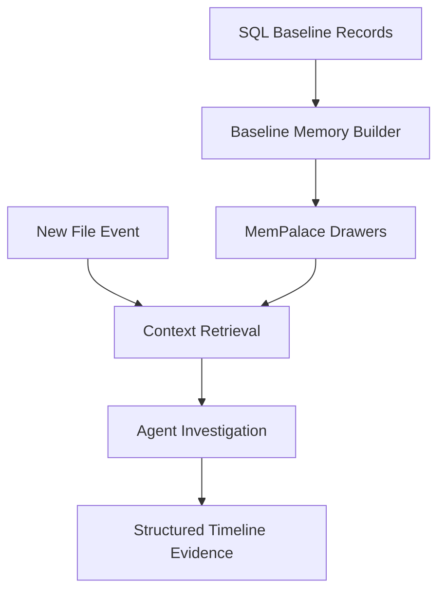

# IntegrityGuard: Context-Aware File Integrity Monitoring for Developer Workstations

Author: Dhanuja Siriwardhena  
Programme: MSc Ethical Hacking  
Institution: Abertay University  
Working status: Full dissertation authoring draft  
Target submission: August 2026  

## Academic Integrity and Authoring Note

This document is an authoring draft and evidence scaffold. It is not a guaranteed
grade outcome and should not be submitted unchanged. The final dissertation must
be revised in the author's own voice, checked against the current university
template, and completed with final measured results, screenshots, supervisor
requirements, citations, and any required declaration of generative AI support.

The project brief for this module requires the submitted dissertation to show
student ownership of the work. Sections that contain placeholders such as
`[INSERT FINAL RESULT]` must be replaced with verified project evidence before
submission. Where this draft assists phrasing or structure, the final submission
should follow the university's policy for acknowledging support.

---

# Front Matter

## Declaration

I declare that this dissertation is my own work except where otherwise stated.
All sources are acknowledged through citations and references. Any external
technical assistance, software libraries, documentation, or generative AI support
used during the project has been declared according to the requirements of the
module and university.

## Acknowledgements

[INSERT PERSONAL ACKNOWLEDGEMENTS]

I would like to thank my supervisor for guidance during the development and
evaluation of this project, and the academic staff who provided support on the
research, security, and software engineering aspects of the work. I also
acknowledge the open-source communities behind the security tools, package
ecosystems, and software libraries that made it possible to build and test a
local file integrity monitoring prototype.

## Abstract

File Integrity Monitoring (FIM) is a long-established security technique that
detects unauthorised file modification by comparing current files against a
trusted baseline. Traditional FIM remains useful because file modification is a
common symptom of compromise, but basic hash-mismatch reporting is often too
noisy for modern developer workstations. Development environments change
constantly through package managers, build tools, temporary files, dependency
updates, logs, browser profiles, operating system updates, and local scripts. A
monitor that reports every change with equal urgency can overwhelm the user and
make genuinely dangerous events harder to recognise.

This dissertation presents IntegrityGuard, a local-first, context-aware file
integrity monitoring system designed for developer workstations and small host
environments. The motivation came from two practical security observations.
First, during ethical-hacking experimentation it was possible to write simple
reverse-shell style payloads that were not always stopped by antivirus products.
Second, modern software supply-chain incidents show that malicious code can
arrive through trusted development workflows such as dependency installation or
library updates. In both cases, the defender benefits from knowing not only that
a file changed, but what the file is, what changed inside it, whether the change
resembles execution or remote-control behaviour, and whether the event deserves
interruption.

IntegrityGuard combines fast baseline capture, hybrid hashing, persistent file
identity, tiered semantic classification, content-aware analysis, MemPalace
context memory, bounded agent investigation, and professional notification
handling. It is implemented as a Python/FastAPI application with SQLite storage,
watchdog-based monitoring, a browser dashboard, optional local LLM support, and
deployable runtime configuration. Evaluation is designed around performance,
notification reduction, suspicious content detection, dependency-compromise
simulation, rename continuity, agent explanation quality, usability, and
deployability. The central argument is that FIM can remain valuable against
modern endpoint and supply-chain threats when it is extended beyond raw hash
comparison into a context-aware and user-centred security workflow.

Keywords: file integrity monitoring, hash baseline, reverse shell, remote code
execution, software supply chain, alert fatigue, local LLM, MemPalace, developer
workstation security.

## Abbreviations

API: Application Programming Interface  
AV: Antivirus  
BLAKE3: Cryptographic hash function used for security-grade verification  
C2: Command and control  
DB: Database  
EDR: Endpoint Detection and Response  
FIM: File Integrity Monitoring  
LLM: Large Language Model  
MFT: Master File Table  
RCE: Remote Code Execution  
SOC: Security Operations Centre  
SQL: Structured Query Language  
UI: User Interface  
XXH3: High-speed non-cryptographic hash function  

## Table of Contents

1. Introduction  
2. Literature Review and Background  
3. Methodology  
4. Design and Implementation  
5. Evaluation and Results  
6. Discussion  
7. Conclusion and Future Work  
References  
Appendices  

---

# Chapter 1: Introduction

## 1.1 Background and Context

Modern host systems are not static. A developer workstation can change thousands
of files during normal use: package managers install dependencies, build tools
write generated artefacts, browsers update profiles and caches, operating
systems rotate logs, and editors create temporary state. Security monitoring has
to operate within this noisy environment. A simple file-change event may be
benign, suspicious, or critical depending on the file role, the expected source
of the change, the content that was introduced, and the user's current activity.

File Integrity Monitoring is based on a simple but powerful idea: if a trusted
state is recorded, future changes can be detected by comparing the current state
against that baseline. Classical systems such as Tripwire demonstrated the value
of recording file metadata and cryptographic hashes for later comparison. Host
intrusion detection platforms such as OSSEC and Wazuh continued that model by
integrating file monitoring into wider host security telemetry. Compliance
frameworks have also treated FIM as an important control because unauthorised
modification of configuration files, binaries, logs, or application code can be
evidence of compromise.

The problem is that raw detection is not the same as useful security judgement.
In a real workstation, a file integrity monitor may detect a changed cache file,
a modified source file, a package update, a renamed document, or a suspicious
script that starts a remote network connection. If all are displayed as generic
hash changes, the user is left to perform the hard work manually. This creates
alert fatigue and reduces trust in the tool. A security monitor that interrupts
too often can become part of the problem.

Developer workstations are especially important because they hold source code,
SSH keys, API tokens, build credentials, package-manager sessions, and access to
repositories or deployment systems. A compromised developer environment can
become a route into a wider organisation. The growth of open-source dependency
ecosystems has also increased exposure to software supply-chain attacks. A
malicious package can be installed through a trusted workflow and still produce
local file changes that reveal the compromise before or during execution.

## 1.2 Practical Motivation

The practical motivation for this project came from ethical-hacking
experimentation and observation of recent software supply-chain compromise
patterns. In controlled learning exercises, simple reverse-shell style payloads
could be created with relatively little effort. The concerning point was not the
novelty of the payloads, but the defensive gap they exposed. Antivirus and EDR
tools are necessary, but they do not remove the need for independent local
evidence. A payload may be written to disk before execution, or a dependency
update may introduce suspicious code into a repository before the user notices
any behaviour.

This project therefore focuses on a defensive question: can a local file
integrity monitor detect and explain changes that resemble reverse-shell,
remote-code-execution, persistence, credential-access, or compromised-dependency
behaviour, without overwhelming the user with low-value notifications?

The second motivation is the dependency-chain nature of modern development.
Package managers such as npm, PyPI, Cargo, NuGet, and Go modules allow developers
to install large dependency trees quickly. This is productive, but it means trust
is delegated across maintainers, packages, build scripts, and transitive
dependencies. Malicious package research has shown that attacks may use install
scripts, typosquatting, dependency confusion, obfuscation, network callbacks, or
credential theft. A tool such as IntegrityGuard cannot replace package ecosystem
security, but it can monitor the local consequences: changed lockfiles, new
scripts, added network APIs, shell execution, and modifications to sensitive
paths.

## 1.3 Problem Statement

Traditional FIM systems answer the question "did this file change?" but often do
not answer "does this change matter?" A naive implementation can produce too
many notifications during baseline scans or normal use, while a purely static
rule system may lack enough context to explain the meaning of a change. In the
context of developer workstations, this creates several problems:

- baseline scans can be slow when every file is hashed and analysed equally;
- path-only databases can fragment evidence when files are renamed or moved;
- low-value changes such as logs and caches can dominate the user interface;
- source code or dependency files may contain suspicious behaviour that is
  invisible to path-only monitoring;
- high-risk alerts need clear explanation, not only severity labels;
- deployment should be simple enough for a new system without hidden local
  state.

The research problem is therefore a combined engineering and security problem:
how can a FIM system preserve the reliability of hashing while adding identity,
semantic role, content inspection, persistent memory, agent reasoning, and
notification control?

## 1.4 Aim

The aim of this project is to design, implement, and evaluate a local-first,
context-aware file integrity monitoring system that detects and explains
security-relevant file changes on developer workstations, with particular focus
on reverse-shell/RCE indicators and software dependency compromise scenarios,
while reducing notification fatigue.

## 1.5 Objectives

O1. Implement a cross-platform file integrity monitor that can scan directories,
hash files, establish a baseline, and store file records in SQLite.

O2. Optimise baseline scanning for large directory trees through hybrid hashing,
metadata-first reconciliation, worker concurrency, and bounded analysis queues.

O3. Preserve file identity across modifications, deletions, renames, and moves
so that a single file has a coherent timeline rather than separate records.

O4. Build a persistent file intelligence registry that classifies files by tier,
semantic role, platform context, path sensitivity, and previous history.

O5. Add content-aware analysis for suspicious source-code, script, dependency,
persistence, credential, and network-callback indicators.

O6. Integrate MemPalace-backed contextual memory and a bounded embedded agent
for deeper investigation of critical and high-risk events.

O7. Design notification handling that prioritises actionable alerts, suppresses
low-value noise, supports batching, and presents professional user-facing
explanations.

O8. Package the system for practical deployment with documentation, environment
configuration, tests, Docker support, and clean runtime-state handling.

## 1.6 Research Questions

RQ1. Can a tiered, context-aware FIM pipeline reduce low-value notification
volume compared with naive hash-mismatch reporting while preserving high-risk
alerts?

RQ2. Can content-aware analysis identify reverse-shell, RCE, persistence, and
dependency compromise indicators in changed files?

RQ3. Does persistent file identity improve timeline continuity after renames and
moves?

RQ4. Does MemPalace-backed agent context improve the explanation quality of
critical and high-risk events?

RQ5. Can the system remain usable and performant when scanning large directory
trees?

RQ6. Can the artefact be deployed on a new system using documented setup steps
without relying on hidden local state?

## 1.7 Contributions

This project makes the following practical and research contributions:

- a working local FIM artefact that combines hashing, monitoring, and analysis;
- a hash-first baseline design using fast XXH3 comparison hashes and BLAKE3
  verification hashes;
- a file identity model designed to preserve continuity across renames;
- a tiered registry that reasons about the importance of file identity;
- content inspection for suspicious behaviours relevant to reverse shells, RCE,
  persistence, and supply-chain compromise;
- a MemPalace-backed memory layer seeded from the SQL baseline;
- an embedded investigation agent for high-risk changes;
- a notification model that separates silent audit logging from user
  interruption;
- a deployment package and documentation for reproducible setup.

## 1.8 Scope and Limitations

IntegrityGuard is a local workstation and small-host monitoring prototype. It is
not a replacement for antivirus, EDR, software composition analysis, package
repository scanning, or central SOC tooling. It does not claim to prove that a
file is malicious in all cases. Instead, it aims to improve the local evidence
available to the user when files change.

The project deliberately avoids live offensive malware deployment. Suspicious
test cases should use inert demonstration payloads or controlled code snippets
that contain detectable indicators without connecting to a real attacker
system. The system is also limited by filesystem access permissions, operating
system APIs, disk speed, CPU resources, and the reliability of optional LLM
components.

## 1.9 Dissertation Structure

Chapter 2 reviews the literature on FIM, hashing, alert fatigue, reverse-shell
and RCE behaviours, software supply-chain attacks, and LLM-assisted triage.
Chapter 3 presents the design-science methodology and evaluation framework.
Chapter 4 describes the architecture and implementation. Chapter 5 presents the
evaluation design, results tables, and product evidence. Chapter 6 discusses the
meaning of the findings, limitations, and ethical issues. Chapter 7 concludes
the dissertation and identifies future work.

---

# Chapter 2: Literature Review and Background

## 2.1 File Integrity Monitoring Foundations

FIM is one of the oldest host-based security monitoring ideas. The core
principle is to establish a trusted baseline for files and later detect
unauthorised modification by comparing hashes, metadata, permissions, ownership,
or other attributes. Kim and Spafford's Tripwire work is foundational because it
formalised the baseline-and-compare model for host integrity checking. The
strength of this model is that it gives defenders a reliable signal that a file
has changed. It does not require knowing every possible malicious payload in
advance.

Host intrusion detection tools such as OSSEC and Wazuh extended this concept by
integrating FIM into broader host monitoring. In practical deployments, FIM is
often used to watch system binaries, startup locations, configuration files,
web-server directories, and security-sensitive application paths. Commercial and
cloud security platforms also use FIM for compliance evidence and change
auditing. PCI DSS requirements, for example, have historically required
monitoring of critical files in cardholder-data environments. This demonstrates
that FIM is not merely an academic technique; it is a mature operational control.

However, traditional FIM has limitations. A changed file is not automatically an
incident. Normal patching, package installation, application updates, and user
activity can produce valid changes. If a FIM system lacks context, it can either
alert too much or require manual interpretation for every event. IntegrityGuard
therefore keeps the reliable baseline principle while adding semantic context,
content inspection, and notification policy.

## 2.2 Hashing, Baselines, and Forensic Hashsets

Hashing is central to integrity monitoring because a file hash provides a compact
fingerprint of file contents. Cryptographic hashes such as SHA-256 and BLAKE3
are designed so that small changes produce different digest values and collisions
are computationally difficult. This is useful for verifying that file content has
not changed. Forensic hashset literature, including work on known-good and
known-bad hash databases, shows how hashes can support triage by quickly
recognising files that are already known.

Hashing also has performance tradeoffs. Scanning hundreds of thousands of files
requires reading substantial data from disk. If every file is hashed with a
security-grade algorithm and then sent for expensive analysis, the system can
become too slow for ordinary use. IntegrityGuard addresses this through a hybrid
strategy. XXH3 is used as a high-speed comparison hash for rapid baseline and
change detection, while BLAKE3 provides a security-grade verification hash when
stronger assurance is needed. This does not make the fast hash a cryptographic
proof; it makes it an engineering tool for quickly identifying candidate changes
that can be verified or analysed further.

The distinction between baseline capture and baseline analysis is also
important. A baseline should be captured quickly so the system has a record of
the current state. Analysis can then be prioritised. This separation prevents a
large initial scan from generating an unbounded analysis backlog.

## 2.3 Alert Fatigue and Usable Security

Security monitoring systems fail when users stop trusting or reading their
alerts. Alert fatigue occurs when a system produces too many notifications, too
many false positives, or messages that do not help the user decide what to do.
Research into usable security warnings shows that warning design affects user
behaviour. A technically correct alert can still be ineffective if it is vague,
too frequent, poorly prioritised, or disconnected from user intent.

For FIM, alert fatigue is especially relevant. Development directories and
operating systems change constantly. A monitor that interrupts the user for
every cache update, log append, or build artefact will quickly become ignored.
IntegrityGuard treats notification design as a core security requirement rather
than a cosmetic UI concern. The system distinguishes silent logging from user
interruption, reserves desktop notifications for high-value events, batches
where appropriate, and presents explanations in a timeline and notification
history.

This approach shifts the evaluation question. The system should not only be
judged by whether it detects changes, because a naive monitor can detect many
changes. It should also be judged by whether it provides meaningful alerts,
reduces noise, preserves important events, and gives the user enough context to
act.

## 2.4 Reverse Shells, RCE, and Local File Evidence

Reverse shells and remote-code-execution behaviours are important because they
represent a transition from local file modification to attacker control. A
reverse shell typically causes a compromised host to initiate an outbound
connection to a remote system, allowing command execution through that channel.
RCE describes cases where an attacker can execute commands or code on a target
system, often through vulnerable software, scripts, build steps, or dependency
logic.

This dissertation does not require live malware execution to be useful. The
defensive question is whether file contents and file locations contain indicators
that should trigger review. Examples include command execution functions,
network callback APIs, suspicious shell invocations, encoded commands, startup
or scheduled-task persistence, credential file access, and modifications to
package lifecycle scripts. MITRE ATT&CK provides a vocabulary for describing
execution, persistence, command and control, ingress tool transfer, and
credential-access techniques.

FIM can provide complementary evidence to antivirus. Antivirus may focus on
known signatures, behavioural execution, or cloud reputation. A context-aware FIM
system can inspect files before execution, compare against previous known-good
state, and ask whether the changed file's role makes the change dangerous. For
example, a network API call added to a temporary test file may be medium risk,
whereas the same pattern added to a package install script or startup location
may deserve immediate attention.

## 2.5 Software Supply-Chain and Developer Dependency Risk

Open-source package ecosystems create powerful development workflows but also
large trust surfaces. Research on malicious npm packages, dependency confusion,
typosquatting, maintainer compromise, and package install scripts shows that
attackers can exploit the fact that developers routinely execute code obtained
from package repositories. Studies such as Backstabber's Knife Collection and
work on npm ecosystem risk show that malicious packages can steal credentials,
open network connections, execute commands, or modify local files. Broader
software supply-chain taxonomies explain how attacks can target source code,
build processes, dependencies, maintainers, and distribution channels.

Recent high-profile supply-chain cases, such as the XZ Utils backdoor recorded
as CVE-2024-3094, demonstrate that trusted development infrastructure can become
a delivery route for compromise. IntegrityGuard does not claim to detect every
source-code backdoor or replace package repository scanning. Its contribution is
to observe local symptoms of compromise after code arrives on the workstation:
modified dependency files, suspicious install scripts, new binary artefacts,
network callback logic, credential access, and changes to project files.

This focus is useful because endpoint compromise often leaves filesystem traces.
If a package install changes a lockfile, writes a postinstall script, modifies a
developer configuration file, or introduces suspicious code into a project, the
local FIM layer can detect and contextualise those changes.

## 2.6 LLM-Assisted and Agentic Security Triage

LLMs are increasingly used to summarise logs, explain code, and assist security
triage. They can be useful when evidence is textual, ambiguous, or spread across
multiple pieces of context. However, they also introduce risks: hallucination,
inconsistent judgement, privacy exposure, latency, and overreliance. For a local
security monitor, an LLM should support deterministic evidence rather than
replace it.

IntegrityGuard therefore uses a local-first design. The SQL database, file
registry, hashing logic, and heuristic content inspection remain the operational
source of truth. Optional LLM and agent components provide explanation and deeper
context for important events. The agent is bounded: it is not a separate
autonomous system with unrestricted actions. It receives structured evidence,
retrieves related MemPalace context, inspects captured content, correlates
trusted-change signals, and returns a typed investigation summary.

This design reflects a broader security engineering principle: automate the
collection and organisation of evidence, but keep final risk decisions grounded
in observable facts.

## 2.7 Research Gap

The literature shows that FIM is mature, supply-chain compromise is an active
threat, alert fatigue affects security outcomes, and LLMs may assist triage.
However, these areas are often treated separately. Traditional FIM detects
changes but may lack semantic explanation. Package-security tools analyse
ecosystems but may not track local workstation changes after installation.
LLM-assisted triage can summarise evidence but may not be integrated into a
carefully bounded local pipeline.

The gap addressed by this project is the design and evaluation of a local FIM
system that combines:

- fast hash-first baseline capture;
- persistent file identity and rename continuity;
- semantic tier classification;
- content-aware suspicious behaviour detection;
- persistent contextual memory;
- bounded agent investigation;
- professional notification handling.

The dissertation argues that this combination is especially relevant for
developer workstations, where legitimate change is frequent and compromised
dependencies can create local file modifications before a wider incident is
obvious.

## 2.8 Literature-to-Requirement Synthesis

The reviewed literature leads to the following system requirements:

| Literature theme | Design implication for IntegrityGuard |
| --- | --- |
| Classical FIM | Establish a trusted baseline and detect changes through hashing. |
| Forensic hashsets | Store compact file fingerprints and support known-state comparison. |
| Hashing performance | Separate fast comparison from stronger verification. |
| Alert fatigue | Avoid interrupting for low-value changes; use severity and batching. |
| Supply-chain risk | Inspect dependency files, scripts, and source-code changes. |
| Reverse-shell/RCE behaviour | Look for network callbacks, shell execution, persistence, and credential patterns. |
| Usable security | Provide explanations and recommended actions, not only scores. |
| LLM triage risk | Keep deterministic evidence as the foundation; bound agent execution. |

## 2.9 Critical Synthesis

The literature does not point toward a single tool category as a complete
solution. Classical FIM provides strong evidence of change, but weakly answers
why a change matters. Endpoint protection and antivirus can detect known
malware, but may not treat a suspicious source-code edit or dependency script as
malicious until execution occurs. Software composition analysis can identify
known vulnerable dependencies, but may not monitor the local filesystem effects
of a package install. SOC alerting platforms can correlate high-volume telemetry,
but are often too heavy for an individual developer workstation.

This creates a design space for a local, contextual FIM artefact. The key
insight is that file integrity monitoring should be treated as an evidence layer
rather than a complete decision engine. The hash tells the system that content
changed. The path and file identity tell the system what object changed. The
registry tier tells the system how sensitive the object is. Content analysis
shows whether the new material resembles suspicious behaviour. Memory retrieval
shows whether the event relates to earlier context. Notification policy decides
how much attention the event deserves.

This layered design addresses a weakness in each individual approach. Hashing is
reliable but semantically shallow. Heuristics are explainable but may be brittle.
LLM summaries are expressive but may be inconsistent. User notifications can
support action but can also cause fatigue. IntegrityGuard combines these
components so that no single layer is expected to carry the entire security
judgement.

## 2.10 Design Principles Derived from the Literature

The literature review leads to six design principles.

First, integrity evidence should be local and reproducible. A file hash,
timestamp, path, file identity, and captured content finding can be inspected
again later. This supports accountability and avoids making the system depend
only on an opaque model output.

Second, context should be attached before notification. A user should not be
interrupted by a message that merely says a file changed. The alert should be
enriched with file role, tier, content findings, and likely reason for severity.

Third, analysis should be proportional to risk. A log append and a privileged
startup-file modification should not consume the same amount of attention or
processing. The pipeline should be cheap for low-value events and deeper for
critical events.

Fourth, the system should preserve history. Rename and move events are common in
real workflows. Treating renamed files as unrelated breaks the user's mental
model and damages evidence quality.

Fifth, the interface should support investigation, not spectacle. The user needs
to scan severity counts, navigate directories, inspect evidence, and understand
recommended actions. A dashboard that looks impressive but hides the event trail
does not improve security.

Sixth, optional AI should be bounded and evidence-driven. The LLM or agent may
help explain a change, but the system should continue to function with
deterministic heuristics and stored evidence if the LLM is unavailable.

---

# Chapter 3: Methodology

## 3.1 Research Approach

This project follows a design-science research approach. Design science is
appropriate because the dissertation centres on the construction and evaluation
of a working artefact that addresses a practical security problem. The artefact
is not only a software product; it is also a testable design proposition:
context-aware FIM can improve the usefulness of file-change monitoring for
developer workstations.

The work progressed through iterative cycles:

1. identify a practical monitoring problem;
2. build a minimum viable FIM pipeline;
3. observe limitations during realistic scans and UI testing;
4. refine the architecture;
5. add context, memory, and agent investigation;
6. evaluate the resulting system against functional and non-functional criteria.

This is suitable for an MSc Ethical Hacking project because the work is both
security-focused and engineering-focused. The security aspect concerns file
change evidence, reverse-shell/RCE indicators, dependency compromise, and alert
quality. The engineering aspect concerns hashing performance, database design,
queue control, UI design, deployment, and maintainability.

## 3.2 Requirements Elicitation

Requirements came from four sources. First, the project proposal defined the
original goal: a hash-based FIM tool using local analysis and intelligent
notification prioritisation. Second, iterative testing revealed practical
constraints such as slow baseline scans, large analysis backlogs, unclear UI
states, and fragmented rename timelines. Third, the literature identified
requirements around alert fatigue, supply-chain risk, and context-aware triage.
Fourth, the target user scenario suggested requirements for deployability and
clear workflows.

The requirements are grouped as functional and non-functional.

| ID | Requirement | Type | Evidence target |
| --- | --- | --- | --- |
| FR1 | Scan a selected directory and record a baseline. | Functional | Scan results and database rows. |
| FR2 | Detect created, modified, deleted, and renamed files. | Functional | Timeline events. |
| FR3 | Hash files using fast comparison and verification logic. | Functional | Hash-mode UI and scan metrics. |
| FR4 | Classify files into tiers and semantic roles. | Functional | Registry output and event metadata. |
| FR5 | Inspect readable content for suspicious indicators. | Functional | Detection scenario results. |
| FR6 | Use MemPalace context for important changes. | Functional | Agent drawer and memory status. |
| FR7 | Notify users through dashboard, toast, desktop, or email policy. | Functional | Notification history. |
| NFR1 | Large scans should avoid unbounded analysis backlog. | Non-functional | Queue metrics. |
| NFR2 | UI should remain usable for many directories. | Non-functional | Tree navigation test. |
| NFR3 | System should be deployable on a new machine. | Non-functional | Setup checklist and smoke test. |
| NFR4 | Analysis should be explainable and reviewable. | Non-functional | Timeline and agent evidence. |

## 3.3 Threat Model

The threat model focuses on local evidence of unauthorised or suspicious file
changes. The system assumes that an attacker, compromised dependency, or
misconfigured process may modify files in monitored directories. It also assumes
that the user may not know whether a change is benign. The system monitors
filesystem state and content indicators rather than network traffic or process
memory.

In-scope behaviours include:

- modification of source-code files to include suspicious network or execution
  logic;
- dependency install scripts that run shell commands or open network callbacks;
- changes to startup, scheduled-task, or service-related files;
- credential or key file modification;
- suspicious additions to configuration files;
- rename or move events that should preserve history;
- large benign changes that should be logged without overwhelming the user.

Out-of-scope behaviours include:

- kernel-level rootkits that hide files from the operating system;
- memory-only malware that leaves no monitored file artefact;
- malware execution or command-and-control traffic analysis;
- central enterprise telemetry correlation;
- definitive malware attribution;
- live offensive payload deployment.

## 3.4 Ethical and Safety Considerations

The project is defensive. It uses controlled indicators and safe demonstration
files rather than live malware. Reverse-shell and RCE concepts are discussed at
a high level to explain what the system detects, not to provide attack
instructions. Any evaluation artefacts should be inert, local, and non-harmful.

The system may inspect file paths and snippets of file content. This creates
privacy considerations because source code, secrets, or personal files may be
present in monitored directories. IntegrityGuard therefore follows a local-first
approach: the database, MemPalace store, and analysis run locally by default.
Optional external services should be disabled during sensitive evaluation unless
explicitly justified and documented.

## 3.5 Development Method

The development method was iterative and feedback-led. Initial versions
implemented baseline scanning, hashing, SQLite persistence, and a simple web
timeline. As testing expanded, several limitations became visible:

- baseline scans created very large pending-analysis backlogs;
- heuristic analysis did not always inspect file content after changes;
- notifications were too generic;
- UI layouts did not scale to large directory trees;
- renamed files could appear as separate timelines;
- hashing performance was slower than desired;
- the agent layer needed to provide real context rather than only wording.

Each limitation became a design change. The baseline scanner was changed so that
normal files are recorded cheaply while suspicious files are queued. A directory
tree model and file identity model were added. Hybrid hashing was introduced.
The UI was redesigned into a professional operations dashboard. MemPalace was
integrated as a derived memory layer seeded from SQL records. The agent was
bounded to investigate high-risk changes and provide structured summaries.

## 3.6 Evaluation Strategy

The evaluation is designed to test both technical function and usefulness. It
uses controlled scenarios rather than live malware. The main scenario groups are:

| Group | Scenario | Purpose |
| --- | --- | --- |
| A | Baseline scan performance | Measure scan time, hash rate, files/s, and queue behaviour. |
| B | Benign file activity | Test noise reduction for logs, caches, and ordinary edits. |
| C | Suspicious source-code changes | Test reverse-shell/RCE indicator detection. |
| D | Dependency compromise simulation | Test package-script and dependency-file changes. |
| E | Rename continuity | Verify one timeline across file renames. |
| F | Agent context | Test MemPalace retrieval and explanation quality. |
| G | UI usability | Verify tree navigation, alert centre, and drawer readability. |
| H | Deployability | Confirm setup on a clean environment. |

## 3.7 Metrics

The evaluation uses quantitative and qualitative metrics.

Quantitative metrics:

- files scanned;
- total data hashed;
- scan elapsed time;
- hash rate in MB/s or GB/s;
- files per second;
- database commit time;
- pending analysis queue size;
- notification count;
- critical/high notification count;
- detection of seeded suspicious indicators;
- false positive and false negative counts for controlled scenarios;
- test suite pass rate.

Qualitative metrics:

- clarity of notification wording;
- whether the alert explains file role and change reason;
- whether the agent provides additional context beyond heuristic analysis;
- whether the UI supports navigation in large directory trees;
- whether deployment instructions are complete enough for a new system.

## 3.8 Validity

Internal validity is supported by controlled test scenarios, repeatable input
directories, and database inspection. Construct validity is supported by mapping
each objective to a specific evaluation group. External validity is limited
because results from one workstation and selected datasets may not generalise to
all filesystems, disks, or enterprise environments. Reliability is supported by
documented setup, automated tests, and repeatable commands.

The evaluation should avoid overstating detection capability. A content pattern
detector can identify suspicious indicators, but absence of indicators is not a
proof of safety. Similarly, an agent summary can improve explanation but should
not be treated as authoritative without the underlying evidence.

## 3.9 Evaluation Protocols

Each evaluation group should follow a repeatable protocol. This is important for
project ownership because the final claims must be traceable to a method rather
than casual observation.

For baseline performance, the protocol is:

1. clear database, cache, and MemPalace runtime state;
2. start the application;
3. select the test directory;
4. record start time, worker count, hash mode, and dataset size;
5. run the scan;
6. record elapsed time, files scanned, bytes hashed, files per second, hash rate,
   database commit timing, and queue size;
7. repeat the scan without changing files to test metadata-first skipping;
8. repeat after modifying a known subset of files.

For suspicious-content detection, the protocol is:

1. create a safe test directory with inert files;
2. baseline the directory;
3. modify one file at a time with a controlled indicator;
4. wait for watcher or scan detection;
5. record timeline event, severity, evidence, notification, and agent output;
6. remove or revert the test file before moving to the next case.

For dependency compromise simulation, the protocol is:

1. create a toy project that resembles a real package layout;
2. baseline the project;
3. modify a package manifest, lockfile, or install script using safe indicator
   strings;
4. record whether the registry role is correct;
5. record whether the event is escalated and explained;
6. compare the output against benign dependency changes.

For deployability, the protocol is:

1. clone the repository into a fresh directory or clean machine;
2. follow the documented setup exactly;
3. record any missing dependency or undocumented assumption;
4. start the server;
5. run a scan against a small mounted or native test path;
6. run the automated tests;
7. document the outcome.

These protocols allow the final results chapter to be written as evidence,
not opinion.

## 3.10 Data Management and Reproducibility

The project produces several forms of data: SQLite database rows, runtime logs,
screenshots, scan metrics, notification histories, agent activity records, and
test outputs. For dissertation evidence, runtime data should be preserved in a
controlled way. Screenshots should include timestamps or surrounding UI context.
Command outputs should be copied into appendices or exported as text files.
Scenario directories should be described so they can be recreated.

Runtime state should not be committed to the repository. Database files,
MemPalace stores, caches, logs, and virtual environments are machine-specific.
Instead, the dissertation should commit scripts, documentation, and small safe
test inputs where appropriate. This supports reproducibility while avoiding
accidental disclosure of local paths, private source code, or sensitive content.

## 3.11 Evaluation Risks

Several evaluation risks must be managed. First, the dataset may not represent a
typical user environment. To reduce this risk, the evaluation should include at
least one small controlled dataset and one realistic developer directory.
Second, suspicious indicators may be too easy or too artificial. To reduce this
risk, the test cases should cover several behaviour families rather than one
keyword. Third, performance can vary by disk speed, antivirus scanning,
background activity, and file size distribution. This should be acknowledged in
the results. Fourth, optional LLM output may vary. The deterministic heuristic
and stored evidence should therefore be reported separately from agent wording.

---

# Chapter 4: Design and Implementation

## 4.1 System Overview

IntegrityGuard is implemented as a local Python/FastAPI application. It uses a
SQLite database for operational state, SQLAlchemy models for persistence,
watchdog for filesystem monitoring, a static browser dashboard for the user
interface, and background services for analysis, notification, registry updates,
and agent investigation. The system is intentionally local-first. It can run
without a cloud service, and optional LLM integration can use local Ollama or
configured external providers where permitted.

The high-level architecture is shown below.


The design separates evidence capture from interpretation. The scanner and
watcher collect file state. The database stores the baseline and timeline. The
registry classifies file importance. The analysis pipeline checks content and
context. MemPalace stores derived contextual memory. The agent investigates
important events. The notification layer decides what should interrupt the user.

## 4.2 Baseline Scanning and Hybrid Hashing

The baseline scan creates the first trusted record of monitored files. Early
iterations treated every baseline event as a pending analysis job. This caused a
large backlog when scanning tens or hundreds of thousands of files. The revised
design separates baseline capture from expensive analysis. Normal baseline files
are stored as records. Suspicious or important files can be queued for deeper
analysis, but the default path is cheap.

The scan pipeline uses:

- recursive directory walking;
- file metadata collection;
- fast hash computation;
- directory tree population;
- file identity creation;
- scan-session progress counters;
- optional analysis queueing for suspicious files.

Hybrid hashing was introduced after performance testing showed that security
hashing every file with a slower algorithm made large scans feel too slow.
IntegrityGuard uses XXH3 as the fast comparison hash and BLAKE3 as the
security-grade verification hash. This design reflects the fact that different
stages have different assurance needs. A fast hash helps determine whether a
file is likely unchanged; a verification hash can be used where stronger
integrity evidence is needed.

Scan progress is exposed to the UI through status metrics such as files per
second, hash rate, bytes hashed, elapsed time, worker count, hash time, and
database commit timing. This is important because large scans may take time and
users need feedback that the system is working.

## 4.3 Metadata-First Reconciliation

A WizTree-like scan cannot be fully replicated in a portable Python prototype
because WizTree achieves much of its speed on NTFS by reading filesystem
metadata structures such as the Master File Table directly. That approach is
platform-specific and requires careful privileges and parsing. IntegrityGuard
instead adopts a practical optimisation path:

- use filesystem metadata before reading full file contents;
- skip hashing when size and modification time indicate no change;
- use platform file identifiers where available;
- avoid re-analysing unchanged content;
- keep scan progress visible;
- reserve expensive analysis for important or changed files.

This does not make the scan instantaneous, because computing a content hash
still requires reading file contents. However, it reduces unnecessary work on
repeat scans and prevents the analysis pipeline from becoming the bottleneck.

## 4.4 Database and File Identity Model

The first data model was path-centred: a file path and hash were enough to
record a baseline. Rename testing showed that this is insufficient. If a file is
renamed, a path-only system can interpret the event as one deleted file and one
new file. That fragments the history and prevents the user from seeing a single
timeline.

IntegrityGuard therefore introduced stable file identity records. Where the
platform provides file identifiers through `os.stat`, the scanner can associate
renames with the same underlying file. Where platform identity is unavailable,
the system can fall back to hash-based matching. Directory tree metadata also
supports navigation and makes the UI easier to use when many directories are
monitored.

The database stores:

- file records;
- file logs and timeline events;
- scan sessions;
- file identity records;
- directory tree entries;
- analysis cache entries;
- notification history;
- registry context and MemPalace-derived state where applicable.

SQLite was chosen because it is simple, local, deployable, and sufficient for a
single-host prototype. For future multi-host or enterprise deployments, a server
database and message queue could be considered.

## 4.5 File Registry and Tiering

The file registry is the core context layer. It answers the question "what is
this file?" rather than only "what does this file contain?" This matters because
the same content can have different risk depending on where it appears. A shell
command in a temporary scratch script may be expected. A similar command in a
startup file, privileged configuration, authentication file, or dependency
install script is more serious.

The tier model is:

| Tier | Meaning | Examples | Default behaviour |
| --- | --- | --- | --- |
| Tier 1 | Critical security or execution asset | Authentication files, privileged binaries, startup and service paths, SSH keys | Immediate high priority review |
| Tier 2 | High-value configuration or service asset | Web-server configs, database configs, app secrets, deployment files | High priority analysis |
| Tier 3 | Application and developer asset | Source code, scripts, package files, project configs | Content-aware analysis |
| Tier 4 | Low-value noisy asset | Logs, caches, temporary files, generated artefacts | Silent logging unless content overrides |

The registry also records semantic roles such as source code, dependency
manifest, credential material, service configuration, log, cache, startup item,
or binary. This enables context-aware analysis. For example, a JavaScript
package manifest with a new install script should be interpreted differently
from an ordinary text file.

## 4.6 Content-Aware Analysis

Content-aware analysis inspects readable files for security-relevant indicators.
This stage exists because path and tier alone are not enough. A source file,
script, dependency file, or configuration file can contain suspicious behaviour
even when it is not located in an operating-system critical path.

The analysis checks for indicators such as:

- shell invocation;
- process creation;
- suspicious PowerShell or command execution;
- network APIs and callback patterns;
- encoded commands;
- credential-file references;
- package lifecycle scripts;
- persistence-related paths;
- suspicious binary download or execution patterns.

The analysis pipeline produces a verdict, risk score, evidence list, and summary
that can be displayed in the timeline. It also reconciles tier and content. A
Tier 4 path may initially be low priority, but readable content can override the
path-only prefilter if suspicious indicators are detected. This was an important
development fix because early heuristic analysis could label a file as low value
without adequately reflecting its actual content.

## 4.7 MemPalace Context Layer

The MemPalace concept was added to make the system remember file intelligence
over time. The SQL database remains the operational source of truth. MemPalace is
a derived context store that helps the agent retrieve related memories when a
new event occurs. At baseline time, the system can seed memory with file
identity, path, tier, semantic role, and known-good state. When a change occurs,
the agent can retrieve related context by path, role, tier, prior verdict, or
similar content indicators.

This matters because a file event should not be analysed in isolation. If a file
has previous suspicious history, belongs to a known sensitive drawer, or resembles
another file recently flagged, that context should be visible. The memory layer
therefore supports explanation and continuity.

The MemPalace flow is:



## 4.8 Embedded Agent Investigator

The agent is designed to be embedded and bounded. It is not an unrestricted
autonomous process running beside the system. It is a service invoked by the
analysis pipeline when policy selects an event for deeper investigation. Events
are typically selected when they are critical, high risk, or above a configured
risk threshold.

The agent receives:

- file path and file identity;
- old and new hashes;
- change type;
- registry tier and semantic role;
- content findings;
- MemPalace retrieved memories;
- trusted-change context, such as installer or package-manager activity where
  available;
- platform context such as Windows service, scheduled task, registry, or signed
  deployment relevance.

The agent returns:

- verdict;
- risk score;
- concise summary;
- evidence bullets;
- recommended actions;
- confidence level;
- notification wording.

This structure prevents the agent from becoming a vague text generator. Its
output must be tied to observable inputs. The UI then displays agent activity in
a drawer so the user can inspect what the agent did without reading raw JSON.

## 4.9 Notification Design

Notification handling was redesigned because early output was too generic and
too verbose. A user-facing security alert should answer four questions quickly:

1. What changed?
2. Why does it matter?
3. How risky is it?
4. What should I do next?

IntegrityGuard separates event recording from interruption. Low-risk baseline
events and noisy Tier 4 changes can be logged silently. Critical and high events
can appear as toasts, dashboard alerts, desktop notifications, or email
notifications depending on configuration. Notification history is exposed in
the UI, and the timeline presents structured sections rather than a single messy
paragraph.

The professional alert structure is:

- title;
- verdict and severity;
- risk score;
- file role and tier;
- reason for escalation;
- key evidence;
- recommended action;
- agent context where available.

This design directly addresses alert fatigue literature by reducing low-value
interruptions and making important alerts easier to act on.

## 4.10 User Interface

The browser dashboard is a practical operator interface rather than a marketing
page. It provides:

- scan path input;
- scan, watch, system monitor, and stop controls;
- monitored file count;
- pending analysis count;
- severity counts;
- file tree navigation;
- searchable monitored file list;
- file timeline;
- alert filters;
- notification toggles;
- agent drawer;
- scan status and hash-rate information.

The UI went through several design iterations. Stylised experimental dashboards
were replaced with a professional, industry-standard operations interface. This
decision improved clarity. The current UI prioritises readable data, compact
controls, clear severity states, and responsive navigation.

## 4.11 Deployment Design

Deployability became a formal project requirement. A security tool is less useful
if it only runs on the developer's machine. The repository includes:

- `README.md` quick-start instructions;
- `docs/DEPLOYMENT.md` deployment guidance;
- `.env.example` configuration;
- `requirements.txt` and `requirements-dev.txt`;
- Dockerfile and Docker Compose support;
- GitHub Actions workflow;
- runtime-state ignore rules;
- commands for clearing local database, cache, and MemPalace state;
- API health and status endpoints.

Docker is useful for reproducible runtime setup, but it can only scan host paths
mounted into the container. Native Python deployment remains important for
desktop monitoring because the scanner needs filesystem access to selected
directories.

## 4.12 Security Engineering Decisions

Several engineering decisions were made to balance security value, performance,
and usability.

The first decision was to make SQLite the local source of truth. A more complex
system could have used a message broker and a server database, but that would
increase deployment friction. SQLite is appropriate for a single-host prototype
and supports a simple clean-slate workflow during testing.

The second decision was to avoid treating the LLM as mandatory. Optional Ollama
or configured external analysis can improve narrative explanations, but the
system must still detect and classify events without it. This is important for
privacy, reliability, and offline use.

The third decision was to reserve deep agent investigation for selected events.
Running agent analysis for every baseline file would recreate the backlog
problem and make the system slower. Risk-based selection means the agent is most
useful where context matters most.

The fourth decision was to make the UI operational rather than decorative. During
development, highly stylised interface experiments were replaced because they
did not improve the user's ability to scan, filter, and investigate file events.
The final design is deliberately plain, professional, and information-led.

The fifth decision was to keep runtime state separate from source code. This
supports deployability, testing, and safe repository sharing. Database files,
MemPalace runtime state, caches, and logs are treated as local artefacts rather
than source assets.

## 4.13 Quality Assurance

Quality assurance used automated tests, manual UI checks, API inspection, and
scenario testing. Automated tests provide regression coverage for scanner,
analysis, API, registry, and notification behaviour. Manual checks are still
needed because UI readability, alert wording, and agent drawer clarity are not
fully captured by unit tests.

The main regression areas are:

- modification events should flip files out of baseline state;
- baseline scans should not create unbounded analysis queues;
- content findings should override low-tier path assumptions where appropriate;
- renamed files should preserve identity where possible;
- notification history should display actionable summaries;
- MemPalace and agent status should be visible through API and UI;
- runtime cleanup should delete project-owned state without deleting dependency
  source checkouts.

Quality assurance also includes codebase presentation. The repository was
cleaned to remove distracting generated comments and to make the implementation
look like maintainable human engineering work. This matters for assessment
because a strong product mark depends not only on features, but on readable,
owned, maintainable code.

## 4.14 Product Maturity

The product is a prototype, but it includes several features associated with
deployable software:

- clear setup instructions;
- environment configuration;
- Docker support;
- API status endpoints;
- automated tests;
- clean runtime-state handling;
- ignored local artefacts;
- UI workflow for scanning and monitoring;
- documentation of design decisions.

This level of maturity supports the 30% product component of the marking scheme.
The artefact is not only an algorithm demonstration; it is a usable local
application with a visible workflow.

## 4.15 Implementation Summary

The final artefact consists of a staged, local-first monitoring system:

1. The scanner records a baseline and scan session metrics.
2. The watcher observes live filesystem changes.
3. The database stores records, logs, identities, and cached analysis.
4. The registry classifies files by tier and semantic role.
5. The content analyser inspects readable changes.
6. MemPalace stores and retrieves contextual memories.
7. The agent investigates selected important events.
8. The notification dispatcher routes actionable alerts.
9. The UI presents scan state, file timelines, notifications, and agent work.

This implementation directly maps to the project objectives and provides the
product evidence required for the dissertation assessment.

---

# Chapter 5: Evaluation and Results

## 5.1 Evaluation Overview

The evaluation is designed to test whether IntegrityGuard satisfies the
objectives rather than only whether the application runs. The evaluation groups
cover baseline scanning, notification reduction, suspicious content detection,
dependency compromise simulation, rename continuity, agent context,
deployability, and usability.

Before submission, this chapter should be completed with final measured data
from the author's machine or a documented test environment. Values should not be
invented. Where this draft uses placeholders, they must be replaced by final
screenshots, command outputs, database counts, and scenario logs.

## 5.2 Test Environment

Record the final environment in the table below.

| Item | Value |
| --- | --- |
| Operating system | [INSERT FINAL VALUE] |
| CPU | [INSERT FINAL VALUE] |
| RAM | [INSERT FINAL VALUE] |
| Storage type | [INSERT FINAL VALUE, e.g. NVMe SSD] |
| Python version | [INSERT FINAL VALUE] |
| Hash mode | Hybrid XXH3 comparison + BLAKE3 verification |
| Database | SQLite |
| Browser | [INSERT FINAL VALUE] |
| Optional LLM | [INSERT OLLAMA/GEMINI/OFFLINE MODE] |
| Test directory sizes | [INSERT FINAL VALUE] |

## 5.3 Baseline Scan Performance

The performance evaluation should measure scan time, files per second, hash
rate, total bytes hashed, workers, and queue growth. The key question is whether
the hash-first and metadata-first design improves practicality compared with the
earlier backlog-heavy pipeline.

| Dataset | Files | Data size | Workers | Elapsed time | Files/s | Hash rate | Pending analysis after scan |
| --- | ---: | ---: | ---: | ---: | ---: | ---: | ---: |
| Small controlled directory | [INSERT] | [INSERT] | [INSERT] | [INSERT] | [INSERT] | [INSERT] | [INSERT] |
| Medium developer directory | [INSERT] | [INSERT] | [INSERT] | [INSERT] | [INSERT] | [INSERT] | [INSERT] |
| Large directory | [INSERT] | [INSERT] | [INSERT] | [INSERT] | [INSERT] | [INSERT] | [INSERT] |

Interpretation to complete after final measurement:

- Compare first scan and repeat scan.
- Explain whether metadata-first skipping reduces work.
- Explain whether worker count improved throughput or caused diminishing returns.
- Explain whether the hash rate is disk-bound, CPU-bound, or database-bound.
- Explain whether the pending analysis queue remains bounded.

The expected outcome is not that every scan is instant. Full content hashing must
read file data, so storage speed remains a real limit. The expected improvement
is that baseline capture is faster, repeat scans avoid unnecessary work, and
analysis backlog does not grow unbounded.

## 5.4 Notification Reduction

Notification reduction evaluates whether IntegrityGuard avoids interrupting the
user for low-value changes while still surfacing high-risk events.

| Scenario | Total file events | Naive alerts | IntegrityGuard user alerts | Silent logs | Reduction |
| --- | ---: | ---: | ---: | ---: | ---: |
| Log/cache activity | [INSERT] | [INSERT] | [INSERT] | [INSERT] | [INSERT] |
| Ordinary source edit | [INSERT] | [INSERT] | [INSERT] | [INSERT] | [INSERT] |
| Mixed benign directory update | [INSERT] | [INSERT] | [INSERT] | [INSERT] | [INSERT] |
| Suspicious source-code change | [INSERT] | [INSERT] | [INSERT] | [INSERT] | [INSERT] |

The important result is not simply fewer alerts. A system could reduce alerts by
missing everything. The result should show that low-value alerts are reduced
while high-risk events still appear with context.

## 5.5 Suspicious Content Detection

This evaluation uses inert controlled files that contain suspicious indicators
without executing malicious behaviour. The purpose is to test whether the system
recognises local evidence relevant to reverse-shell or RCE-like changes.

| Test case | File role | Seeded indicator | Expected severity | Actual severity | Evidence displayed |
| --- | --- | --- | --- | --- | --- |
| Source file with network callback API | Source code | Network API call | Medium/High | [INSERT] | [INSERT] |
| Script with command execution | Script | Shell/process execution | High | [INSERT] | [INSERT] |
| Encoded command string | Script/source | Encoded command | High | [INSERT] | [INSERT] |
| Credential path reference | Config/source | Credential access | High | [INSERT] | [INSERT] |
| Startup path modification | Startup/service | Persistence location | Critical | [INSERT] | [INSERT] |

The qualitative evaluation should inspect the timeline card and notification
output. A good result should include structured evidence bullets rather than a
single unstructured paragraph. The user should be able to understand why the
file was flagged.

## 5.6 Dependency Compromise Simulation

The dependency-compromise scenario models the local effects of a malicious or
compromised package. The test should not install live malicious packages.
Instead, it can use a local toy project with safe files representing package
manifests, lockfiles, install scripts, and source files.

Example test design:

1. Create a clean toy project.
2. Baseline the project.
3. Add a safe dependency-like file change containing suspicious install-time
   behaviour indicators.
4. Modify a lockfile or manifest.
5. Observe whether IntegrityGuard detects the changes, classifies the role, and
   raises an appropriate alert.

| Scenario | Expected result | Actual result |
| --- | --- | --- |
| Package manifest adds suspicious lifecycle script | High alert with dependency context | [INSERT] |
| Lockfile changes only | Logged or medium depending on context | [INSERT] |
| Source file adds suspicious network command | Medium/high content alert | [INSERT] |
| Benign dependency update | Logged or low/medium with minimal interruption | [INSERT] |

This directly evaluates the project motivation: catching local signs of
developer-library compromise and notifying the user before the event is lost
among ordinary file changes.

## 5.7 Rename Continuity

Rename continuity tests whether a renamed file remains in one timeline. This was
a major design issue during development because path-only monitoring can create
duplicate identities.

| Step | Expected behaviour | Actual behaviour |
| --- | --- | --- |
| Baseline file `new text document.txt` | One file record and timeline | [INSERT] |
| Rename to `text 2.txt` | Same identity, rename/update event | [INSERT] |
| Modify renamed file | Modification appears in same timeline | [INSERT] |
| Filter by severity | Event remains findable | [INSERT] |

The result should include a screenshot of the UI timeline and, ideally, database
evidence that the same file identity is preserved.

## 5.8 Agent and MemPalace Evaluation

The agent evaluation asks whether the agent adds useful context beyond
heuristics. A weak result would be an agent that only repeats a severity label. A
strong result should show retrieved memory, file role, content findings, and
recommended actions.

| Test case | Registry role | MemPalace context retrieved | Agent verdict | Added value |
| --- | --- | --- | --- | --- |
| Suspicious source-code modification | Source code | [INSERT] | [INSERT] | [INSERT] |
| Critical path change | Critical system or startup file | [INSERT] | [INSERT] | [INSERT] |
| Repeated similar indicator | Related memory | [INSERT] | [INSERT] | [INSERT] |
| Benign high-tier trusted change | Trusted change correlation | [INSERT] | [INSERT] | [INSERT] |

Evaluation questions:

- Did the agent run only for selected important events?
- Did it retrieve relevant MemPalace memories?
- Did it inspect actual file content or captured change payload?
- Did it produce structured evidence?
- Did the UI agent drawer make the result understandable?

## 5.9 Deployability Evaluation

Deployability is evaluated by setting up the project in a clean environment and
running a smoke test.

| Check | Expected result | Actual result |
| --- | --- | --- |
| Clone repository | Repository downloads successfully | [INSERT] |
| Create virtual environment | Environment created | [INSERT] |
| Install requirements | Dependencies installed | [INSERT] |
| Start server | API available on localhost | [INSERT] |
| Scan test directory | Baseline created | [INSERT] |
| Open dashboard | UI loads and shows stats | [INSERT] |
| Clear runtime state | Database/cache/MemPalace removed safely | [INSERT] |
| Run tests | Test suite passes | [INSERT] |
| Docker build/run | Container starts and scans mounted path | [INSERT] |

This section supports the product mark because it shows the artefact can be used
beyond the original development machine.

## 5.10 Usability Evidence

Usability is evaluated through task-based inspection rather than a large user
study. The key workflows are:

- start a scan;
- monitor scan progress;
- navigate the file tree;
- filter by severity;
- inspect a suspicious timeline event;
- open and close the agent drawer;
- understand the notification summary;
- clear runtime state for a clean test;
- restart the system.

The dissertation should include screenshots of:

- main dashboard;
- scan progress metrics;
- file tree navigation;
- structured timeline event;
- notification/alert history;
- agent drawer;
- deployment or terminal smoke test.

## 5.11 Results Summary

Complete this table after final testing.

| Objective | Evidence | Status |
| --- | --- | --- |
| O1 baseline monitor | Scan records, database, UI | [INSERT] |
| O2 scalable hashing | Performance table | [INSERT] |
| O3 rename continuity | Rename test | [INSERT] |
| O4 tiered registry | Registry metadata | [INSERT] |
| O5 content analysis | Suspicious content scenarios | [INSERT] |
| O6 MemPalace agent | Agent evaluation | [INSERT] |
| O7 notification handling | Notification reduction | [INSERT] |
| O8 deployability | Clean setup and Docker test | [INSERT] |

## 5.12 How to Write the Final Results Interpretation

The final results section should avoid unsupported claims such as "the system is
fast" or "the agent works well" unless the data shows why. Each result should be
interpreted against an objective.

For performance, discuss whether scan rate improved enough for practical use and
which bottleneck remains. If the target was 1 GB/s hash throughput and the final
result is below that, explain whether the cause is disk throughput, worker
contention, file size distribution, antivirus interference, or database writes.
This critical honesty is stronger academically than hiding a limitation.

For detection, separate true positives, false positives, and false negatives.
If a suspicious file is flagged because of two network APIs, state that the
system detected indicators of interest, not confirmed malware. If a benign file
is escalated, discuss whether the escalation is acceptable because of file tier
or whether the rule should be refined.

For notifications, show before-and-after examples. A weak notification says
"hash changed." A strong notification says "source file changed; network API and
shell execution indicators were introduced; no trusted package update was
observed; review is recommended." This demonstrates the project's contribution.

For the agent, focus on added context. If MemPalace retrieves related memories
and the agent uses them to explain why the event matters, that supports the
research question. If it repeats the heuristic result, discuss that as a
limitation and identify prompt or retrieval improvements.

For deployment, include any setup friction encountered. A dissertation earns
credibility by explaining what worked and what needed adjustment.

## 5.13 Product Evidence Checklist

The final dissertation should include product evidence in the main text or
appendices:

- screenshot of the dashboard after a clean scan;
- screenshot of scan performance metrics;
- screenshot of a structured high-risk timeline event;
- screenshot of the agent drawer;
- screenshot or output from notification history;
- output from automated tests;
- clean setup command sequence;
- Docker or native deployment evidence;
- database or API evidence for rename continuity;
- examples of benign and suspicious scenario files.

Each screenshot should have a caption explaining what it proves. Screenshots are
not decoration; they are product evidence.

---

# Chapter 6: Discussion

## 6.1 Interpretation of Findings

IntegrityGuard demonstrates that FIM can be adapted for modern developer
workstations by combining reliable baseline detection with context-aware
analysis. A raw hash mismatch is useful evidence, but it is not enough for a
user who must decide whether to ignore, investigate, or respond. The tiered
registry, content inspection, MemPalace memory, and agent drawer make the event
more meaningful.

The most important design decision was the separation between capture and
analysis. Baseline capture needs to be fast and comprehensive enough to record
the system state. Analysis needs to be selective enough to avoid backlog and
alert fatigue. Earlier iterations showed that analysing every baseline event is
not scalable. The final design records normal files cheaply and reserves deeper
analysis for changed, suspicious, or high-value files.

Another important finding is that file identity matters. A path-only system can
lose history when a file is renamed. This is not only a UI issue; it affects the
quality of evidence. Preserving timeline continuity helps users understand that
a renamed and modified file is the same object rather than unrelated events.

## 6.2 FIM as Complementary Defence

IntegrityGuard should be viewed as complementary to antivirus and EDR, not a
replacement. Antivirus may stop known malware or suspicious execution, while FIM
observes local file changes and content before or after execution. This is useful
for developer environments where compromise may arrive through normal workflows.
A malicious dependency may not initially appear as a known malware binary. It
may appear as a changed package script, a modified source file, or a new network
callback.

The system's value is therefore in early local evidence and explanation. It
helps the user answer: "This file changed; is that expected, and why is it being
flagged?"

## 6.3 Performance Tradeoffs

Content hashing is fundamentally limited by disk throughput and file count.
There is no cross-platform way to instantly know the content hash of every file
because common filesystems such as NTFS and exFAT do not store a ready-made
cryptographic content hash for each file. A scanner must read file contents to
compute hashes. Tools such as WizTree are very fast at enumerating filesystem
metadata on NTFS because they use platform-specific metadata structures, but
content hashing remains a read workload.

IntegrityGuard's performance strategy is therefore pragmatic:

- hash quickly with XXH3 for comparison;
- use BLAKE3 where stronger verification is required;
- skip unchanged files through metadata-first reconciliation;
- avoid full analysis for every baseline file;
- cache analysis by content and context;
- keep scan status visible to the user.

Increasing workers can help until the disk, CPU, or database becomes the
bottleneck. Beyond that point, more workers may reduce performance through
contention. The evaluation should therefore report measured worker behaviour
rather than assume that higher worker counts are always better.

## 6.4 Agentic Context: Benefits and Risks

The MemPalace agent improves explanation when it retrieves relevant file memory,
combines it with registry context, inspects content findings, and produces
structured recommendations. This addresses the user's original concern that an
"agent" should not be redundant wording. The agent is useful only if it performs
contextual analysis that the base pipeline does not already provide.

However, agentic analysis also has risks. It can be slower, inconsistent, or
overconfident. It may summarise evidence incorrectly if prompts or inputs are
poorly designed. IntegrityGuard mitigates this by keeping deterministic
heuristics, hashes, and SQL records as the source of truth. Agent output is
presented as an investigation summary with evidence, not as unquestionable
proof.

## 6.5 Notification Design as Security Design

The notification redesign is not merely cosmetic. In security operations, a
poorly designed alert can cause missed incidents. The project moved from raw
generic messages to structured explanations. This supports user trust and
reduces cognitive load. A good notification tells the user what happened, why it
matters, and what to do next.

The final interface also separates different levels of attention. A timeline can
record everything. A toast can show important dashboard events. A desktop or
email notification should be reserved for urgent cases. This hierarchy is
essential for usability.

## 6.6 Limitations

The main limitations are:

- The prototype is single-host and local-first.
- SQLite is appropriate for the prototype but not ideal for multi-host
  enterprise scale.
- Full content hashing can still be slow on very large datasets or slow disks.
- The system cannot detect memory-only attacks that do not modify monitored
  files.
- It cannot prove a file is safe if no suspicious indicators are detected.
- LLM and agent outputs require careful interpretation.
- Docker deployment can only scan paths mounted into the container.
- Platform-specific optimisations such as direct NTFS MFT scanning are future
  work rather than fully implemented functionality.

## 6.7 Validity and Confidence

Confidence in the system should be based on repeatable evidence: test outputs,
controlled scenario results, screenshots, database records, and deployment
checks. The final dissertation should explicitly discuss false positives and
false negatives. A high-quality result is not a claim of perfect detection; it
is a clear explanation of what was detected, under what conditions, and with
what limitations.

## 6.8 Ethical Reflection

The project was motivated by offensive-security learning, but the artefact is
defensive. Care was taken to avoid live malicious deployment in evaluation.
Dissertation examples should describe behaviours at a defensive level and use
safe simulated files. The ability to detect reverse-shell indicators does not
require publishing operational payloads. The system should also respect privacy:
file content snippets and paths can be sensitive and should remain local unless
the user explicitly configures external analysis.

## 6.9 Comparison with the Initial Proposal

The final system extends the initial proposal significantly. The original
concept focused on hash monitoring, SQLite storage, tiered prefiltering, local
LLM analysis, and notification dispatch. During development, the artefact gained
hybrid hashing, scan-session metrics, directory tree navigation, file identity,
rename continuity, analysis caching, MemPalace memory, agent investigation,
structured notification handling, deployment documentation, and test coverage.

This evolution strengthens the dissertation because it shows genuine design
iteration rather than a one-pass implementation.

## 6.10 Comparison with Alternative Approaches

A basic Tripwire-style monitor would provide strong hash-change evidence but
would not address the context and notification goals of this project. It would
be simpler and potentially more predictable, but the user would still need to
interpret many raw changes manually.

A host intrusion detection platform such as OSSEC or Wazuh would provide broader
security monitoring and mature rule handling. However, these platforms are
larger operational systems and may be more complex than required for a local
developer workstation dissertation artefact. IntegrityGuard is narrower but
more focused on contextual file intelligence and the MemPalace/agent workflow.

A software composition analysis tool would be more appropriate for identifying
known vulnerable dependencies, but it would not necessarily monitor arbitrary
local file changes, rename continuity, or source-code edits after baseline.
IntegrityGuard is complementary: it observes local effects, not package
ecosystem reputation alone.

An EDR product would provide stronger enterprise telemetry, process monitoring,
and response capability. IntegrityGuard does not compete with EDR. Its value is
as an explainable local integrity and context layer that can be understood,
modified, and evaluated within the scope of an MSc project.

## 6.11 Contribution to Practice

The practical contribution is a workflow that a developer or small-team operator
can understand. The user chooses a directory, establishes a baseline, monitors
changes, and receives contextual alerts when important files change. The system
does not require a central SOC or enterprise platform to demonstrate value.

The project also contributes a useful framing: file monitoring should not end at
"changed" or "unchanged." A modern workstation monitor should consider file
identity, role, content, memory, and user attention. This framing can guide
future development even if individual implementation choices change.

## 6.12 Contribution to Knowledge

At dissertation level, the knowledge contribution is not a new cryptographic
hash function or a new malware classifier. The contribution is the design and
evaluation of an integrated artefact that bridges several areas: FIM, usable
security, supply-chain compromise, local LLM-assisted triage, and agentic memory.
The research value lies in showing how these ideas can be combined into a
coherent local system and critically evaluating the resulting tradeoffs.

The project also demonstrates how user feedback can reshape a security tool.
The progression from naive baseline analysis to bounded queues, from path-only
records to file identity, from generic alerts to structured notifications, and
from superficial agent wording to MemPalace-backed investigation shows design
learning. This is important evidence of project ownership.

---

# Chapter 7: Conclusion and Future Work

## 7.1 Conclusion

This dissertation presented IntegrityGuard, a local-first context-aware file
integrity monitoring system for developer workstations. The project began with a
traditional FIM idea: scan files, hash them, and detect changes. Through
development and testing, the system evolved into a richer monitoring pipeline
that combines hashing, file identity, tiered registry classification, content
analysis, MemPalace context memory, bounded agent investigation, and professional
notification handling.

The central argument is that FIM remains valuable, but it must be adapted to the
conditions of modern development environments. Developer machines change
constantly, and supply-chain compromise can arrive through normal dependency
workflows. A useful monitor must therefore distinguish low-value noise from
changes that affect sensitive files or introduce suspicious behaviour. It must
also explain alerts in language that supports action.

IntegrityGuard addresses this by separating baseline capture from expensive
analysis, using hybrid hashing for performance, preserving identity across
renames, classifying files by role and tier, inspecting changed content, and
using an embedded MemPalace agent for selected high-risk events. The result is a
prototype that can be evaluated not only as a hash monitor, but as a contextual
file-intelligence system.

## 7.2 Objective Review

O1 was addressed by implementing directory scanning, hashing, SQLite persistence,
and a browser dashboard. O2 was addressed through hybrid hashing,
metadata-first reconciliation, analysis caching, and scan progress metrics. O3
was addressed through file identity and rename handling. O4 was addressed by the
tiered registry. O5 was addressed through content-aware suspicious indicator
analysis. O6 was addressed through MemPalace memory and the embedded agent. O7
was addressed through structured notification handling. O8 was addressed through
deployment documentation, configuration, tests, and Docker support.

The final evaluation should complete this objective review with measured
evidence from Chapter 5.

## 7.3 Future Work

Future work could extend IntegrityGuard in several directions:

- implement optional NTFS metadata fast-path scanning for Windows systems;
- add a server database and message queue for multi-host deployments;
- integrate package-manager event logs more deeply;
- add signed-binary and certificate reputation checks;
- add richer diffing for source-code changes;
- support policy profiles for developers, servers, and high-security systems;
- improve UI workflows for resolving, muting, or escalating alerts;
- add redaction controls for sensitive file snippets;
- evaluate the system with a larger user study;
- compare against established FIM tools using the same scenario dataset.

The most important research extension would be a controlled comparative
evaluation against a traditional FIM baseline. That would allow stronger claims
about notification reduction, detection quality, and user decision-making.

---

# References

Atzeni, A. and Lioy, A. (2006) 'Why to adopt a security metric? A brief survey',
in Proceedings of the First International Conference on Availability,
Reliability and Security. IEEE.

Bauer, L., Bravo-Lillo, C., Cranor, L.F. and Fragkaki, E. (2013) 'Warning design
guidelines', Carnegie Mellon CyLab.

Bray, R., Cid, D. and Hay, A. (2008) OSSEC Host-Based Intrusion Detection Guide.
Syngress.

Hevner, A.R., March, S.T., Park, J. and Ram, S. (2004) 'Design science in
information systems research', MIS Quarterly, 28(1), pp. 75-105.

Kim, G.H. and Spafford, E.H. (1994) 'The design and implementation of Tripwire:
a file system integrity checker', Proceedings of the 2nd ACM Conference on
Computer and Communications Security.

Ladisa, P., Plate, H., Martinez, M. and Barais, O. (2023) 'SoK: Taxonomy of
attacks on open-source software supply chains', arXiv.

MITRE (2024) MITRE ATT&CK Enterprise Matrix. Available at:
https://attack.mitre.org/

National Vulnerability Database (2024) CVE-2024-3094 Detail. Available at:
https://nvd.nist.gov/vuln/detail/CVE-2024-3094

Ohm, M., Plate, H., Sykosch, A. and Meier, M. (2020) 'Backstabber's Knife
Collection: A review of open source software supply chain attacks', arXiv.

Ruback, M., Hoelz, B. and Ralha, C. (2012) 'Analyzing and creating forensic
hashsets', Digital Investigation.

Sejfia, A. and Schafer, M. (2022) 'Practical automated detection of malicious
npm packages', Proceedings of the ACM.

Sundaramurthy, S.C., Case, J., Truong, T., Zomlot, L. and Hoffmann, M. (2016) 'A
human capital model for mitigating security analyst burnout', Symposium on
Usable Privacy and Security.

Tariq, M., et al. (2025) [INSERT FULL DETAILS FROM FINAL LITERATURE REVIEW].

Vielberth, M., Bohm, F., Fichtinger, I. and Pernul, G. (2020) 'Security
operations center: A systematic study and open challenges', IEEE Access.

Zimmermann, M., Staicu, C.A., Tenny, C. and Pradel, M. (2019) 'Small World with
High Risks: A study of security threats in the npm ecosystem', USENIX Security
Symposium.

Zhang, [VERIFY AUTHORS] (2023) 'Cerebro: Malicious package detection in npm and
PyPI using a single model of malicious behavior sequence', arXiv.

Zhao, [VERIFY AUTHORS] (2024) [INSERT FULL DETAILS FROM FINAL LITERATURE
REVIEW].

OSCAR authors (2024) [VERIFY AUTHORS] 'Dynamic package poisoning detection',
arXiv.

XZ Utils analysis authors (2025) [VERIFY AUTHORS] Analysis of the XZ Utils
backdoor. [INSERT FINAL SOURCE DETAILS].

---

# Appendices

## Appendix A: Rubric Alignment Matrix

| Marking area | Weight | Dissertation evidence |
| --- | ---: | --- |
| Abstract | 5% | Abstract states problem, method, artefact, evaluation, and contribution. |
| Introduction | 5% | Aim, objectives, research questions, scope, and motivation are explicit. |
| Literature review | 15% | FIM, hashing, alert fatigue, supply-chain risk, reverse-shell/RCE, and LLM triage are critically synthesised. |
| Methodology | 15% | Design-science method, threat model, metrics, validity, and ethics are described. |
| Results and discussion | 15% | Evaluation chapter maps objectives to measured scenarios and discussion interprets tradeoffs. |
| Conclusion and future work | 10% | Objective review, contribution summary, limitations, and future research are included. |
| Structure/references | 5% | Dissertation follows the expected chapter model and includes Harvard-style references. |
| Product | 30% | Working implementation, dashboard, agent drawer, deployment docs, tests, and scenario evidence. |

## Appendix B: Evaluation Scenario Checklist

- Baseline scan small directory.
- Baseline scan medium developer directory.
- Baseline scan large directory.
- Repeat scan with metadata-first skip.
- Benign log/cache changes.
- Ordinary source edit.
- Suspicious source-code indicator.
- Dependency compromise simulation.
- Rename and modify same file.
- Agent drawer inspection.
- Notification history inspection.
- Clean deployment smoke test.

## Appendix C: Suggested Figure List

1. High-level architecture.
2. Baseline scan and hashing pipeline.
3. Analysis and notification pipeline.
4. Database and file identity model.
5. MemPalace memory and agent flow.
6. Dashboard screenshot.
7. Agent drawer screenshot.
8. Evaluation scenario workflow.

## Appendix D: Suggested Commands for Evidence Collection

```powershell
# Start the application
python -m uvicorn core.api:app --host 127.0.0.1 --port 8000

# Run tests
python -m pytest tests -q

# Check scan status
Invoke-RestMethod http://localhost:8000/api/scan/status

# Check application stats
Invoke-RestMethod http://localhost:8000/api/stats

# Check agent activity
Invoke-RestMethod http://localhost:8000/api/agent/activity
```

## Appendix E: Generative AI Use Log Placeholder

If required by the university policy, include a short appendix that records how
generative AI was used. The final version should be honest and specific. It may
include:

- tool used;
- date range;
- purpose of use;
- examples of acceptable support, such as debugging suggestions or structure
  planning;
- confirmation that final analysis, results, and authorship decisions are the
  student's responsibility.

## Appendix F: Final Submission Checklist

- Replace all `[INSERT]` placeholders.
- Verify every reference and complete missing bibliographic details.
- Insert final screenshots and captions.
- Insert final performance results.
- Insert final test output.
- Insert final deployment evidence.
- Check all objectives are answered in Chapter 5 and Chapter 7.
- Convert to the university dissertation template.
- Proofread for spelling, grammar, and academic voice.
- Confirm generative AI declaration requirements.
- Prepare viva/demo evidence.
